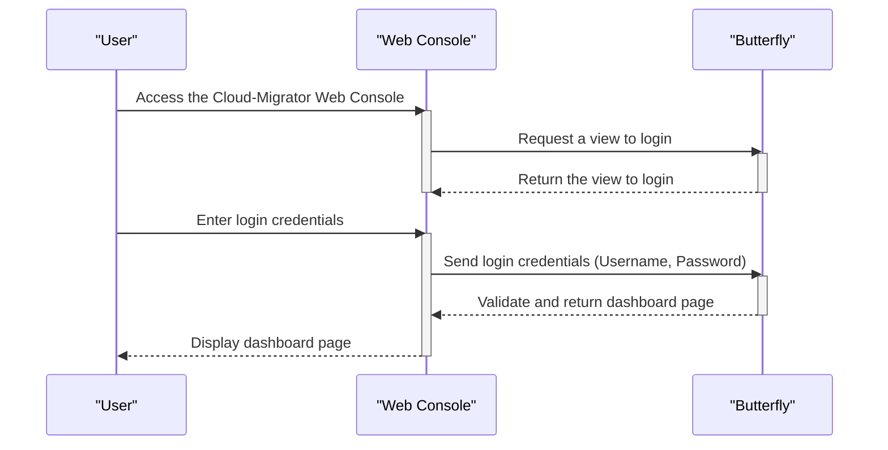
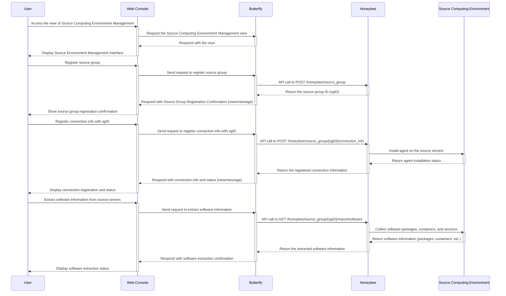
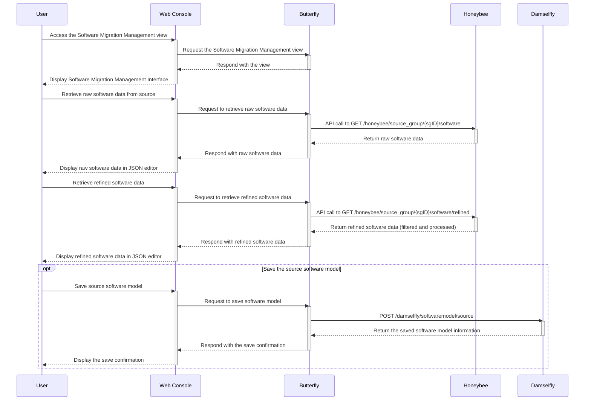
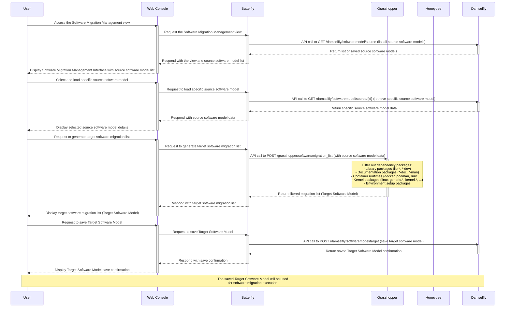
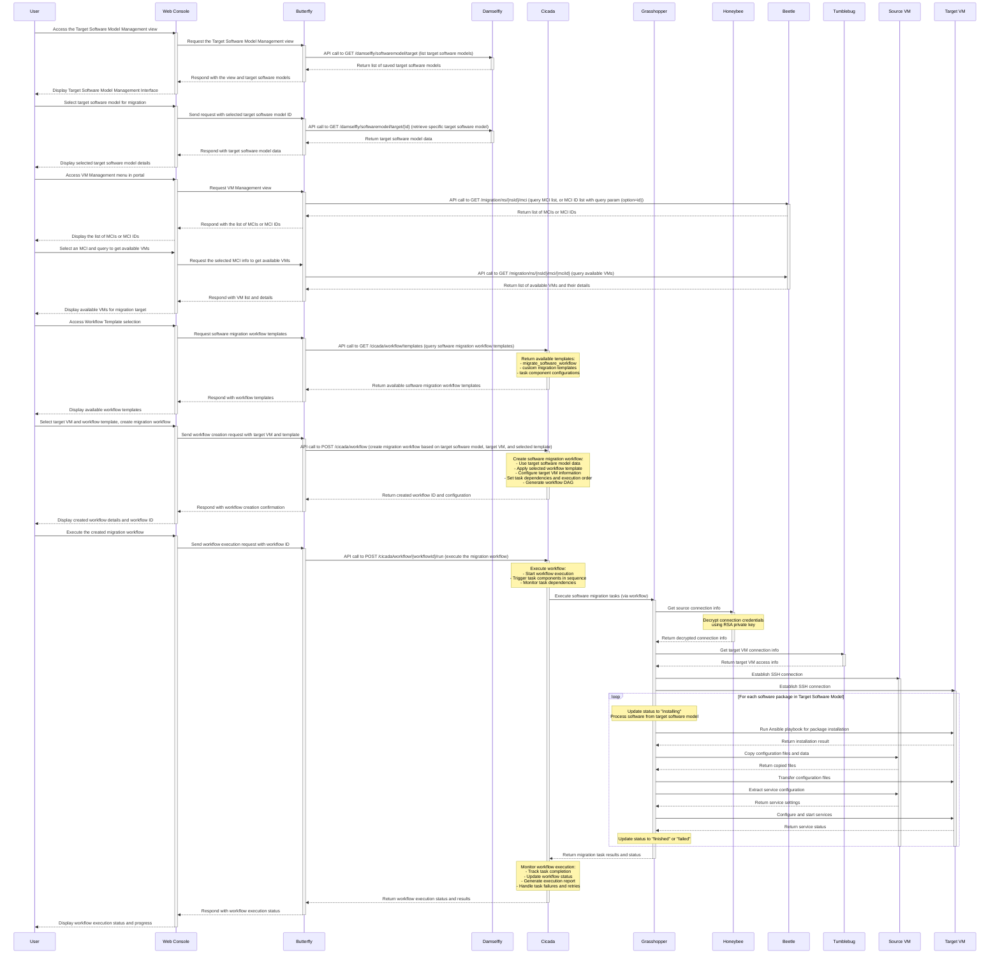
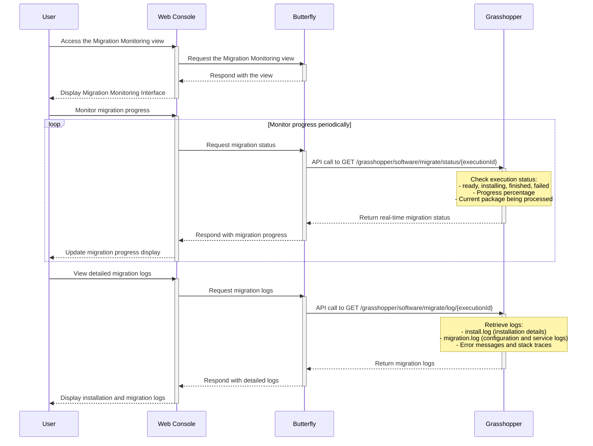

# Software migration scenarios

The sequence diagrams represent user scenarios for software migration.

> [!NOTE]
> Cloud-Migrator v0.4.0 통합 및 릴리스를 위한 Sequence Diagram 입니다.

> [!NOTE]
> Sequence Diagram은 대부분 2단계로 구성될 것 입니다. 다음 예시를 참고 바랍니다.
>
> 1. (사용자가 포털에서 페이지를 요청하는 단계)
>
> - Butterfly(서버)는 이를 위해 Subsystem들의 API를 호출하고
> - 얻은 정보를 바탕으로 View를 구성 및 제공하는 단계
>
> 2. (사용자가 해당 View 에서 마이그레이션을 요청하는 단계)
>
> - 마이그레이션에 필요한 정보를 입력 후 마이그레이션을 요청하고,
> - Butterfly(서버)가 관련 Subsystem 들의 API를 호출을 통해 마이그레이션을 수행 및 결과를 제공하는 단계

> [!TIP]
> 수정, 보완이 필요한 사항들에 대해 많은 의견을 부탁드립니다.
> 제안) 수정/보완 사항을 PR로 오픈하고 논의하면 좋을 것 같습니다. 🙌

## Login

: Participants: Butterfly

[View Mermaid in Full Screen](https://mermaid.live/view#pako:eNqdVNtqGzEQ_ZVBEGhhbbyO7V3vQ6Bx-hgoMWmg-EVZTdaCXWmri13X-N872htu4zaketKMzhwdHWl0ZLkWyDJm8btHleOd5IXh1UYBjZobJ3NZc-Xg0aIBbmHDwmzDXiNujd4PoCd8hpVWVpd4CUvLazS7Hn3rnUPzUh4CtkVfXcHaYQ1xBp_yHK0Ft0VYldqL0b0kjU4bON-lqQraRjc3nZR3lfLcyR132J-jzXYBcQ6SM3gIZlkHHHYS9-A0lLqQ6g-eoaDND-HoXOADOm9UI_ACl8C_sZ2tDHp_N26awWdFrrZ8kBsUqJzkpb1s1T_B7zBnjUq8poEPYT_FK4zgC7d2r434-D-GfeWlFAHNaRvTuie43T5rbgS9sQLfsq5XTayPDeWdtHXJD2_RdHUsYhWaiktBbXMMqA2j66vonWc0FfjCfenCQz4RlHun1weVs8wZjxEz2hfbPvB1OEnXcn2S-uOb1uchy47sB8uu42Q8maXJIo6v54tpsozYgWXzZEyJeBFPltM0TeNkforYz4ZgMp7PCEpjMk2X8XwWscIE2Z0Uuig0K-2VI5qIoZDUGPftf9B8C6dfNsBh3g)

## Register the source computing environment and extract software information

: Participants: Butterfly, Honeybee, Source computing environment

[View Mermaid in Full Screen](https://mermaid.live/view#pako:eNqtV9tu4jAQ_RXLUqVWolzaUmgekHZL1eVhtVXZi7RCqlwzgLXEztoOLYv49x3HSQi3cml5wU5mzozPnBPCjHLVBxpQA39jkBzagg01C3uS4Cdi2gouIiYt-WFAE2aS7_W7v-D5VkmjxuBicEfS7Xro59ha0IPx1EXmm_W4L0rC9BkSwGy9HtXV_E5OXExXxZoD1g2j2Ao5JHhdaCVDkLYnfebJCelaiEg1SM_DORgDbyeTr0yyISTLnwJePJTLP2-1FgcPyKcEjdgRkAnGETXYF9dDMm7FhFkosOlvLPZYMacsII9uaMYmFfc9wSQ_QV5uZQj59nzlfI9gIiX75EXYUX5Kn9OHbWiF3hHOsRaQtjDRmE2znrd02pEOh3FYK1HkZ3mwNdflUBjMzNDvtYqjrTPLo42PHi6iDx5HF5Acnc1E4XI39lbuW61M9Cishw7hbDx2oA_fut9JZZTeq3jop03Qy6bJduerErKxlsk0i12STpucmmGnfbZG_jLsfmIpjiKlXDMrlHSPiYHQod-cOkFVQjQRauDsGGV1R-pl-SC6WI0Xqh2gqouCTjBEAk_QOnKgdguLLxIEJnhCHLUfrbJ9C32k5CozV2BeWdR-Ejkru5TYavmnd4BMGuuK4djR-GpJj0jtBLRZgfSZ_qJfny_1n-raAwoP7zWASxubtekXAXd7JSMd-qu0b1PXMbZZnSjDG779D7BK9hAuFFnyyqLYAU65DMjdKyJw_GVWA_vCNCQ2WWJlg1uyJJMlFagkA63Ct9VwrHfgjbLvdc393S7TiDBS2lay4oea5laNx1BsPmL8D6rBlNxMLRMSiSr5OSJrAl9OjjPRxqGcbq4GlpfP3mmudCrore1zeaezcuC01s4fhwMMtQl7p5FoiYaAxUUfX8ZnLrBHkYsQejTAZR8GLB7bHu3JOYay2KruVHIaWB1DiaKqhqNsE0d9xE5f5LOL-LL8W6nilgYz-kqDy1qjXL1qNq5rtcv69UXjpkSnNKg3ynihdl2r3lw0m81aoz4v0X8JQLVcv8JQ_FQvmje1-lWJDrVrO20FLQb6VsXSIkyJQl9Ypb_6fxnJn435f4hkXV0)

## Retrieve and refine software information from source environment, then save it

: Participants: Butterfly, Honeybee, Damselfly

- 해당 과정은 Honeybee로 부터 Source측의 정제된 Software 목록을 얻을 수 있는 Source의 Software Model 입니다.

[View Mermaid in Full Screen](https://mermaid.live/view#pako:eNq1lm1v2jAQx7-KZanSJtFCaCk0L5C2MnWd1LWCdZMmpMlNLmApsTPbKWOI777Lg8NTKCnb8gZ8Of_ufPeP7QX1pA_UpRp-JiA8GHA2USwaC4JPzJThHo-ZMORRgyJMZ7-7b98rOSscvsETuZZCyxAq_BJjQAXhPPUsB7t-H6WA-RNA6mb_73oNWKQhLGjlYCxyz5MTMjIQk5ZbJO95oDVoMpKBmTEF5I7jWg2XgtwxwSYQAUK_cpjlgHTWab9frM0l7zIAMVM4gHguEcwz_JkZsAXKrcUgZdsSuGSYdkCbI_GbpSyHp-v5D0HHUvhkxs00C7MC-bAXVeSKoMeMMuA6Dtn8QI63IoUwD3b5thKbXXJccgOGDNlsRR4ww6pbMQSjODwDUeivrb-P_iRQMkJTomzsY3ogidoboW7p-32rXJTOwy3xWBim5JsPX0hzWrxq5pn-mCiZxM2FntwOlk0bbivS5odgR6fbSzCJEvuyXuvDJq2GYg4j60pnt2lckE-j-88EfG6kqquZdqEZCLgA_3W6Kea82Nnj9FKH_P800yzi_412qlZA3gQ8REe0M1RErGS2m_pv_4Gw9lfsGHFVZv9qgd3H6ZbGwkxpLhkxbG26Z-a1X9EjPD_DfJaMTS2_KmFm8w7MqRZmHXHqnH4Iu1nhbWWWB6xLHu5HqEffGkrxZeTm-ua7EWDtiLbvSlO1FLNKYvL-VvbYz0CqKDt2VrC1hlaEqnkoZrXypAj4S_yqWu1T5Cuo640F4dMGjQAncB-vaIvUPKZIi2BMXfzrQ8CS0IzpWCzRlSVGjubCo65RCTQobg-TqR0kMX4H9npnjXiL-i7l-pC6C_qLuudO96x10eteOs5557LdvWrQOXU73TM0OJdO66rd6_WcbmfZoL8zQOusc4Gu-LTavSunc9GgE5WmXaSCiwF1LRNhENOg-Wd4l989syvo8g8ty56q)

## Generate target software model, then save it

: Participants: Butterfly, Grasshopper, Honeybee, Damselfly

- 해당 과정은 Honeybee로 부터 Source측의 정제된 Software 목록을 얻고 난 후 사용자가 원하는 Software들을 선택하고 Migration 리스트를 요청하면 얻을 수 있는 Target의 Software Model 입니다.

- Migration List를 가져오는 Grasshopper API에 Honeybee로 부터 얻어온 Software 리스트를 전달하면 패키지 타입에 한해서 아래와 같은 패키지들을 제외하고 의존성으로 참조되는 패키지들을 제외 합니다.
- Honeybee로 부터 얻어온 Software 리스트에는 메인 패키지외에 의존성으로 같이 존재하거나 환경 구성을 위해 존재하는 패키지들이 있습니다. 해당 패키지들은 주요 메인 패키지를 설치할때 같이 설치되어 지기 때문에, Grasshopper에서는 해당 패키지들을 필터링 하고 마이그레이션 리스트를 작성합니다.
  - 라이브러리 패키지나 개발용 패키지(보통 lib으로 시작하거나, -dev로 끝나는 경우)
  - 문서 패키지 (.\*-doc, .\*-man)
  - 컨테이너 런타임 관련 패키지 (docker, podman, runc, ...)
  - Kernel 관련 패키지 (linux-generic.\*, kernel.\*, ...)
- 해당 동작은 Migration 과정을 단축시키고 동일한 패키지가 여러번 참조될 수 있는 중복 작업을 방지합니다.
- 이 과정으로 인해 Grasshopper를 통해서 Target 쪽으로 Migration 수행시 실제로 참조되는 Software 목록을 확인 할 수 있습니다.
- 이 목록은 Target에 Software들을 구성하기 위한 Target Software Model이 됩니다.

1. 사용자는 Web Console을 통해 저장된 Source Software 목록을 조회합니다.
2. Butterlfy 모듈이 Damselfly로 부터 저장된 Source Software 목록을 가져옵니다.
3. Web Console에 저장된 Source Software 목록이 표출됩니다.
4. 사용자가 Web Console을 통해 Target Software 목록 요청을 합니다.
5. Butterfly 모듈이 Grasshopper 모듈로 Migration List를 가져오는 API에 Source Software 목록을 전달합니다.
6. 패키지 타입에 한해서 의존성으로 같이 존재하거나 환경 구성을 위해 존재하는 패키지들을 제외 합니다.
7. Web Console에 Software Migration List를 표출하게 됩니다. 이는 Target Software Model이 됩니다.
8. 사용자가 Web Console을 통해 Target Software Model 저장 요청을 합니다.
9. Butterlfy 모듈이 Damselfly 모듈로 Target Software Model을 저장하는 API를 요청합니다.
10. 저장된 Target Software는 추후 Target에 Software Migration을 수행하는데 사용됩니다.

[View Mermaid in Full Screen](https://mermaid.live/view#pako:eNqtV21v2zYQ_iuEgAJuIb8lcewIRYCt6bJiTVfU6QYMBgZaOttEJFIjKTtekP_eI_ViWZJf4sZfLFIPnzvePccTnxxfBOB4joL_EuA-3DA6lzSacIK_mErNfBZTrsl3BZJQZf_rb3-VYpUB_oYp-SC4EiE04BKtQc7CtUEWgzruVlKlFiKOU87SsI79XXBYTwEMMH-uo25opCDMLBeDCU-Rb96QsYaY9Lxso74PSoEiYzHTKyqB3DGMi2aCkzvK6RwiQNK_GKxSArOqfX2dxcEjv1gCohdwgGJZUFBfsyXVkAcznc0GhjsPl0e-mWwpfSL9dti3A9A35FoyWAJRdAkB8ifSL5tBwYQkZGh-JkVUjqX1N2dHj4tXGI-vn4hPw5BoQW4_3pNukL_rqow5MsQ4suZa1oBZkE3kKGJh6m1lUxUvimG7GjidSJ56L2bZDpstpEQB7DJR3W45-99AxYIHZMX0wibJpIFQvsOW9admr5KnXAho57s1csNUHNL1AQF84oaEok3rzEvs5zLcVsiZRz4LijuJwWcz5jcLpLkqxhCCr20gwi2ORrdOLwtxCn0l3K-i4-4TC55JSxYltdejnxP1fm4SUE0PafoINb-A_FgBK6uKXYWIjJqyhnrcoc9zj9wCB2kg91TOQTdVyOdC8VWNlkQ0z3l0yrNxrODZVM5pOj3RxG6tllrltlq__jlGuc43rwvBdgtb_9qDsXUg0VWZ1rrzF4GzYol9dMub31iIbhKRaExjDDzAD441Nmn_AQ8r5b2fyu51GzMzlVRu5k0rmHbeueRdO4Dl2wx1I_zEnG9piDZYBAnfYCPKcyx-jaCCMM5EJlyzyOAQ9QDSJbEIEOmaN7is0-nki_4AyXG_ZS948ti2-WK-8efBIsxTadlHvmRScHv0KqzLuGBIQ1MKSHMVz2yQsBi2BUBaNS2XToxSVdSScUyHOkJ7J9T1ftqjd7Sjzi-wnWD7Jo0sB0tbHVh6WjUfz_riZpOW765uk4W6ZR2oxf0Veov9UGrcGfEFnzEZ2cy-RoMxW9jLeaz-mt09gr-c8uqJZky4pJSk-wXsDc-KYQKnQBIFgT0kZkI21QQ8gp-YJ8d1IkDfWID3sidjf-LgN2QEE8fDxwBmNAn1xJnwZ4TSRIvxmvuOp2UCriNFMl_kgyTG8zq_0-WTeB36R4jy0PGenEfHO-8PO72L0fCy3z8fXJ4Nr1xn7XiDYQcn-pf93tXZaDTqDwfPrvO_Jeh1BhcIxV_vbHTVH1y4zlwatzNXzBEvPwg8dJHGdSBgWsi79MJp753PPwCJtxJm)

## Execute software migration

: Participants: Butterfly, Cicada, Damselfly, Grasshopper, Honeybee, Beetle, Tumblebug

[View Mermaid in Full Screen](https://mermaid.live/view#pako:eNqtWVtP4zgU_itWpJVYqUyBgYGJVkgssAwP7M5SZkZaIY1Mclos0jhjO2W6iP--x7fEubSkLH2AuDk-1-9c7D5FCU8hiiMJP0rIEzhjdCbo_DYn-CmoUCxhBc0V-SJBECrN_-7b3wV_dATf4I6c8lzyDHroSqVATLOlpqwWXbozOpeQObpq0aU7ZQlNqSayT12KC0GlvOdFYbULll3aTzyH5R2AJvTPXaqbcn6XwV0502TVoks34aVI4OuVJrPP5OtVDzsqZqAsmX02ZJbwl1_IREFBdmIXgCQBKaGinPCpeqQCyBWGMSNXNKczmAOy_crg0fLQG7ePj12IYnJieBB1Dy9zWVRcaKLYgirwobbfuoVm74MZk2uNJaleL6GJi8oT16AEgwUQSReQ9rOWTi_PAjWr4IOmf74kCc0yoji5OL8h49S_G0vHZq65jJXlvZUxbYddeApiSOSvLa1bKK2W223nqFLkxDDmU2dKvwTLKIVVItqmhkG-BlnwPCWPTN2bQGg_E5oPltUKgg80yvhiBJwxWWR0-XKAL3PNhybQFeGR1MT6bkwmkEGi-nn3g9rt6DWOTLkgc4Z1TTGebwznCaDXhMO08ac0wlbFjVyebQzoAhI2Zck6i98G0uMnlj6TLdGR3GvK_8N4v3dSqujbIXu4iKGAfiG4KSjK-vKlH8x7Vb3FCh9khc7Ev0sQS3KyQH4UmwhSyLUVu8kB_5SE5aTgQtHs1UW6yXSDamy1p6H2ZCr4vN0SQ9xWr3pwq_y7cS7HT7m8TJ_H84RJsvWjK6kNzJbMarm--DaVN8XxHphYGeOWlMEoRR8bkVrCSvwMhGfL4WFlc4gdCs33sYthXW0qTt-4eJhm_JHcwBzFKliPzA65y6LXlFsPzDrvKq0evRjV1GogVgfZaTEcTpMhgO33PehNzIux13BcaejhO8icNqxDNf7k-AVf4BDolXBorhFR8Yl_uxPj420nC7574d-9SPc-KaVCawMEeQ6OQFH5QBI-Ryzr8pDwfMpmpSV2zrfa9CdardoG0QyQG9o_ONsG8N082YYw7U-z_ZicCtAEXdgNmWX0yUCb1lZgRBLLtuvR1404lQTDV_NrDD1NdbwW6xPwpdT5_Nekmztka6Vh5I5K7Mx8xWwxqpUcGS3rXu7U3SzBXNzWYNcnGoZwzSziiE6KIgvmi05EHdmpSzIIXM5yrPRzI9tRTUDZ7EyhwOjh2Z2B7WHwE5LSaMlFCsLRX0AOuhbUYs9OLl7OYBuKQNnLMyOkUQnW5u0mGVshz7B3Br86ezu6u97bzCc_rb-cyQcxOTe-HZ7Knl6fwLw6b56vdcAbCdux8E2zdPzkn_SgJsqcbEFgbNfIzVLPO66daBPMCdVjunt9I9hshmyafUvqOdnfcDnKK54zxUU3h1qjg7thUpZx4wLJ7NUXKYKXs_sepRrpdXwcbK0N7Ckulu3WgtGVzutcY1X6nkuFDYvJezKZfNJ5lNs5zNkVbESN_CVXjOVBVy5zSVXvMWWnJbl5L1YHrmZ1BolYFirkg9BH7ypGMztYlJLlM3I9OSGFsGwfwIHR89luO8wVpNRyh7RfzyCLm5r2mR8cRy4gbLjrXbDusNGnctA57bjcq27v4aKpr79RjFdGuaWp39BrvLt3XM3MK1Gr6La0IeegXCNYH0vQsvsa3QVNHvCQqRNxzR1HxnlB_njl5iYeG4H4UqSmkSuqSqlL2m3EclxlGeLwNjKY_Cy4CU4l1RwEept6LW-VS6-xHp7kkunRUfeiO84fjFdqU4z4oMEZKDkGq5AU7sJiL8tM1ZtXaVWj5pQXy2bnJlOWubGhvjTRH79plSYJLxjmoNn-sjtuBM3lFKPSI3wTA85_KoFoxFouFsyWqvYUMkR5v12CUgiAAQbUM5kZK00Tclzk8PBVcg0O-wwfjt8pyzFjIb2NcMzTa5xs9Mrywm4WJmlQZpolIaw_PckduiMYDpw5zY7l8Ci9hyoLAxmdttVt_L4vd7tpXPV4zKG6w2cQ9H_nqGqz1aM9AocDk74-c-8_oeb6FK05a3diuK019rZ0wHm3ZyRzMbNsjIPebFpuC3n1oLxe7ULwGaq-8sAbjaI54KzO0iiOnjTVbYQj4BxuoxgfU5hSXacQmc9ISkvFJ8s8iWIlShhFZnbyi9KEz_0G6b8saP4P5-Eyip-in1H8fvfw3c7-0eGH3d33Bx_2Dj-OomUUHxy-wy92P-zufNw7OjraPTx4HkX_GgY77w72kRQ_O3tHH3cP9kfRTGi1nSp6BhSnvMwVshlFkGokXtkfSM3vpM__AUygLEE)

## Monitor software migration progress and logs

: Participants: Butterfly, Grasshopper

[View Mermaid in Full Screen](https://mermaid.live/view#pako:eNqlVmtr2zAU_StCUNjAeThtmtSMwJaWUlhHadcNRr6o1o0j6kieJKfNQv77rm3ZcRYnzTZ_sSWde3Qf58pa0VBxoAE18DMFGcKlYJFm84kk-CRMWxGKhElLHg1owkz-3l39pNWLA3yHJzJW0qgYGnCptaCn8TJDVoNd3LVmxsxUkhScteFEFuiTE_JgISHdwLkWhmAMGHIrMAArlCS3SgqrtJAR-SbgpbDLwK3RyDkckI-5HbEzaLZcVJYstGLBLJTBFrNukFGW4QTkPsumsX_Hup2Natiqe3sPJlGSkxdhZzn7hojDXirnIhI95iyXwiQxWza7diMzWxbCLm0Z93YF_KA0rxHeaRVpTGxz0kv8vMInW_jmVMdKJZVpaUBQE0JxEbK4jPfNsmy2NZbZ1GzM9qVwuyKjUU2QKKG7G5JtT6wi11dfSSfarHaMmtoXpqFTbAqdYsvOCl4hTDMnbvi6wYEtyZerXxSuqAXKfcuB8QzCZ1IRuqiCD0-6M2oRDYwvPSIkTscxltgjUyGFmQHHLyZi4A55V8tpCNKyCNzKONUaJ7BHw2ecJU-QSQVrkDcd33hY86v1Z_JtqmXmTdyyYg4HqlDTXGMajuiNfco63CmN3fKY8Ay6y0h40UeFLUh-bMf0gvxAqrXLZxXtaZUcyMHmdao5EVcW_3AuHabZdxD9l-xxoybN7y_0Hq2jjLSABeSelxJ32m7jHHnnBkV8RebMewesAi-goZJTEaUuFwzFgylbiLBgL42utM7OKqw4St8UMIuNQKzGY9Kl703hN-X8kNCPEHkli0bGY_8CW_nKgnvDU0dEPToHPWeC4_VhlaEmFP9Ic5jQAD85TFka2wmdyDVCWWrVw1KGNLA6BY9qlUazcpDmHeauHuUk3gN-KFUf0mBFX2lw6g_a3bPh4Nz3T_vnvcGFR5c06A_aOOGf-92L3nA49Af9tUd_5QTddv8Mofh0e8MLv3_m0UhnbjtXsHNBj1UqLdJ4FHj2g7kt7kX59Wj9G4U8Ktk)

