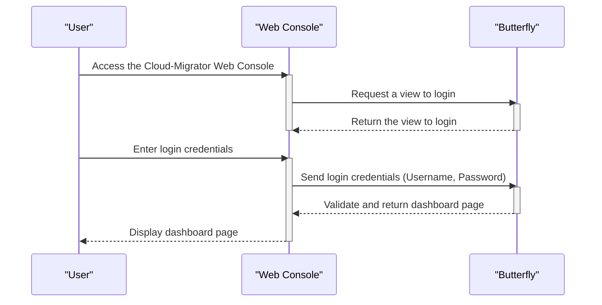

# Software migration scenarios

The sequence diagrams represent user scenarios for software migration.

> [!NOTE]
> Cloud-Migrator v0.4.0 통합 및 릴리스를 위한 Sequence Diagram 입니다.

> [!NOTE]
> Sequence Diagram은 대부분 2단계로 구성될 것 입니다. 다음 예시를 참고 바랍니다.
>
> 1. (사용자가 포털에서 페이지를 요청하는 단계)
>
> - Butterfly(서버)는 이를 위해 Subsystem들의 API를 호출하고
> - 얻은 정보를 바탕으로 View를 구성 및 제공하는 단계
>
> 2. (사용자가 해당 View 에서 마이그레이션을 요청하는 단계)
>
> - 마이그레이션에 필요한 정보를 입력 후 마이그레이션을 요청하고,
> - Butterfly(서버)가 관련 Subsystem 들의 API를 호출을 통해 마이그레이션을 수행 및 결과를 제공하는 단계

> [!TIP]
> 수정, 보완이 필요한 사항들에 대해 많은 의견을 부탁드립니다.
> 제안) 수정/보완 사항을 PR로 오픈하고 논의하면 좋을 것 같습니다. 🙌

## Login

: Participants: Butterfly

## User scenarios

> [!NOTE]
> 현재 도출된 사용자 시나리오 초안 입니다.
> 향후, 각 시나리오 별로 Sequence Diagram을 작성할 예정 입니다.
> 참고 - [Computing Infrastructure Migration Scenario](./01-user-scenario-for-computing-infra-migration.md)

(소스 컴퓨팅 환경에서 SW 형상 정보(Raw data) 또는 소스 SW 모델(Refined) 추출)

1. (사용자가) CM portal 에서 소스 그룹 및 연결 정보 등록 요청 :arrow_right: (Honeybee API 호출됨) Honeybee가 대상 Server들에 Agent를 설치함 (비동기)
2. (사용자가) CM portal 에서 소스 컴퓨팅 환경의 SW 분석 및 추출 요청 :arrow_right: (Honeybee API 호출됨) Honeybee가 SW 형상 정보 / 소스 SW 모델을 제공함

(소스/목표 SW 사용자 모델 운영 및 관리)

3. (사용자가) CM portal 에서 소스 SW 모델을 소스 SW 사용자 모델로서 저장 요청 :arrow_right: (Damselfly API 호출됨) Damselfly가 소스 SW 사용자 모델을 저장 및 관리함
4. (사용자가) CM portal 에서 소스 SW 사용자 모델을 확인 및 수정하여, 목표 SW 사용자 모델로 저장을 요청 :arrow_right: (Damselfly API 호출됨) Damselfly가 목표 SW 사용자 모델을 저장 및 관리함

(SW 마이그레이션 대상 패키지 등록)

5. (사용자가) CM portal 에서 목표 SW 사용자 모델을 SW 마이그레이션 대상 패키지로 등록 요청 :arrow_right: (Grasshopper API 호출됨) Grasshopper가 목표 SW 사용자 모델을 바탕으로 Ansible Playbook을 생성, 저장 및 관리함

(SW 마이그레이션 워크플로우 생성 및 실행)

6. (사용자가) CM portal 에서 SW 마이그레이션 Workflow template 조회 (사전 정의 필요) :arrow_right: (Cicada API 호출됨) Cicada에서 SW 마이그레이션 Workflow template 제공
7. (사용자가) CM portal 에서 SW 마이그레이션 Workflow 수정 후, 생성 요청 :arrow_right: (Cicada API 호출됨) Cicada에서 입력된 SW 마이그레이션 Workflow 생성/저장 및 관리
   (사용자가) CM portal 에서 SW 마이그레이션 Workflow 실행 요청 :arrow_right: (Cicada API 호출됨) SW 마이그레이션 Workflow 실행 :arrow_right: (Grasshopper API 호출됨) SW 마이그레이션 실행 :arrow_right: (Tumblebug API 호출됨) 대상 VM 접속 정보 조회 :arrow_right: (Grasshopper에서) 기 정의된 Playbook을 바탕으로 SW 마이그레이션 실행 :arrow_right: (Grasshopper에서) SW 구동에 필요한 파일/정보/데이터를 전송/복사/주입
8. (사용자가) CM portal 에서 SW 마이그레이션 Workflow 실행 결과 조회 :arrow_right: (Cicada API 호출됨) SW 마이그레이션 Workflow 실행 결과 제공

(마이그레이션된 SW 구동 상태 확인)

9. (사용자가) CM portal 에서 마이그레이션된 SW 구동 상태 확인 요청 :arrow_right: (Grasshopper API 호출됨) 소프트웨어 구동 상태 제공

---

여기서 부터 Sequence Diagram 작성됨

## TBD
