# Computing infra migration scenarios

The sequence diagrams represent user scenarios for computing infra migration.

> [!NOTE]
> 원활한 Cloud-Migrator v0.3.0 통합 및 릴리스를 위해 Sequence Diagram을 작성하였습니다.
> 그 동안 협의된 사항과 사용자 시나리오를 바탕으로 작성되었습니다.

> [!TIP]
> 수정, 보완이 필요한 사항들에 대해 많은 의견을 부탁드립니다.
> 제안) 수정/보완 사항을 PR로 오픈하고 논의하면 좋을 것 같습니다. 🙌

## Login

: Participants: Butterfly

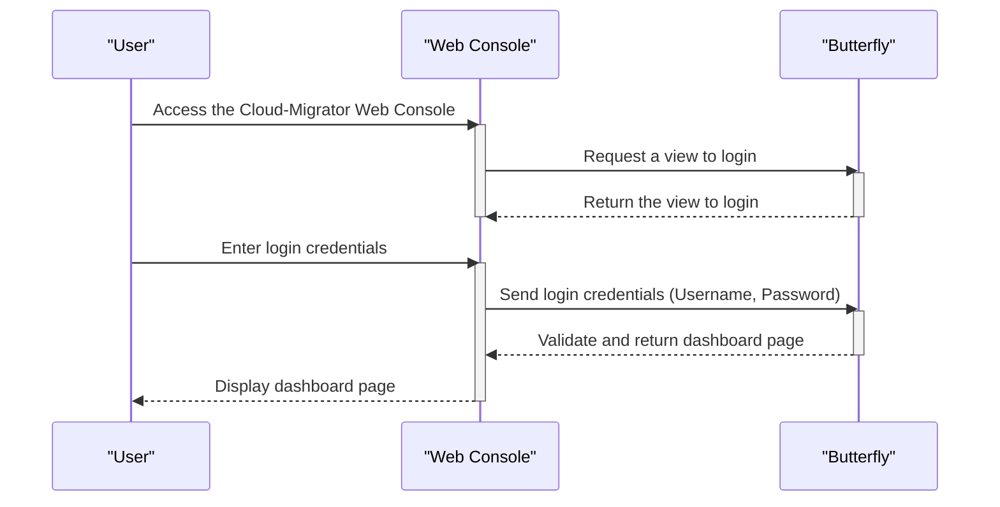

## Register the source computing environment 

: Participants: Butterfly, Honeybee, Source computing environment

: Computing environment includes computing infrastructure, software, data
: Currently, we're concentrating on the compuing infrasturcture.

> [!IMPORTANT] 
> Question) Honeybee README에서 한번에 하나의 서버에 대한 Connection Info를 등록하는 예시를 확인할 수 있습니다. 한번에 여러 서버들의 Connection Info를 등록할 수 있는 방법이 있는지요?

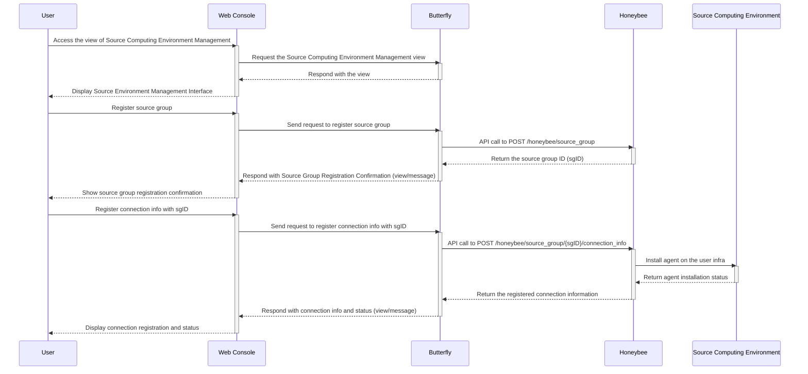

## Extract information from the source computing environment

: Participants: Butterfly, Honeybee, Source computing environment

> [!IMPORTANT] 
> Question) `GET /honeybee/source_group/{sgID}/import/infra`에서 import 용어 변경/개선이 필요해 보여 의견을 남겨놓습니다. 

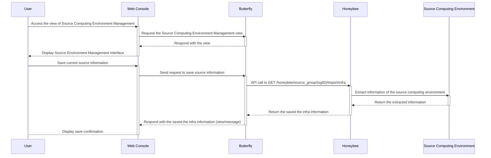

## Retrieve the information of source computing environment (raw data, shape information)

: Participants: Butterfly, Honeybee

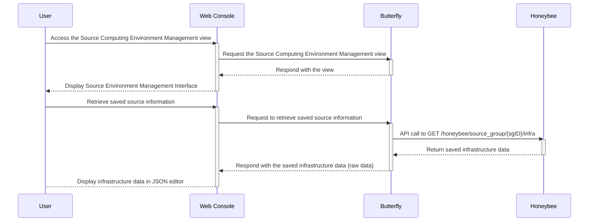

## Retrieve the information of source computing environment (refined data, onpremise model)

: Participants: Butterfly, Honeybee, Damselfly

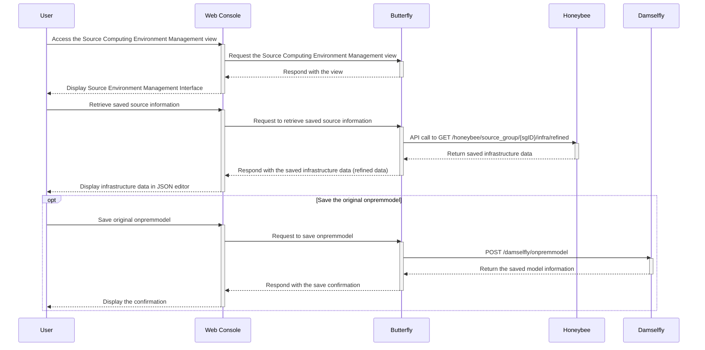

## Register or modify user's source model

: Participants: Butterfly, Damselfly, Honeybee

> [!IMPORTANT]
> Opinion) 모델 관련 UI 구성과 이를 위해 필요한 API 목록, 호출 순서, 호출 시점 등에 대해 논의/정리가 필요해 보입니다.

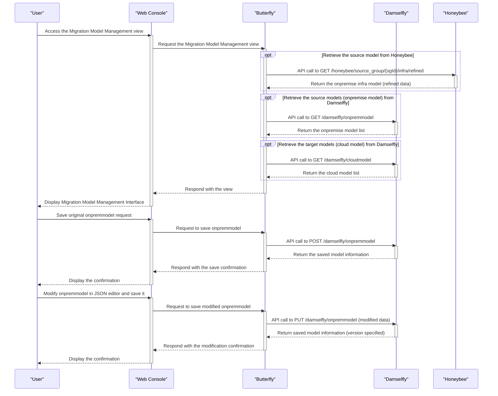

## Recommend the target computing infrastructure

: Participants: Butterfly, Damselfly, Beetle, Tumblebug

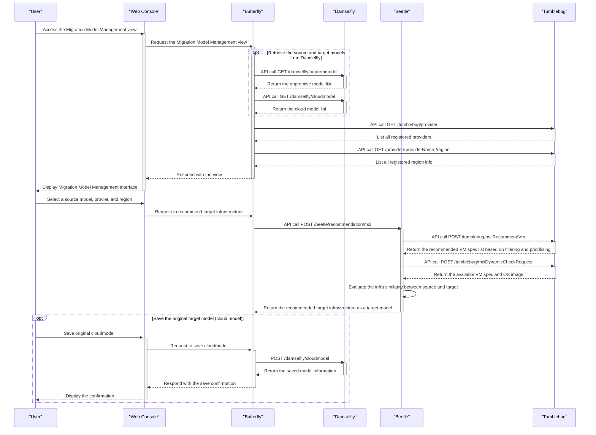

## Register or modify user's target model

: Participants: Butterfly, Damselfly

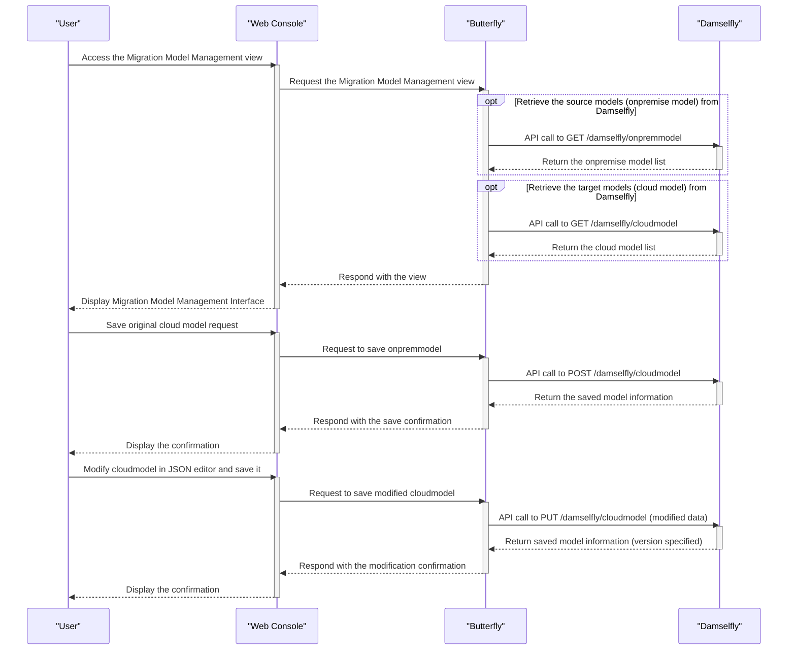

## Migrate to cloud infrastructure

: Participants: Butterfly, Damselfly, Beetle, Tumblebug

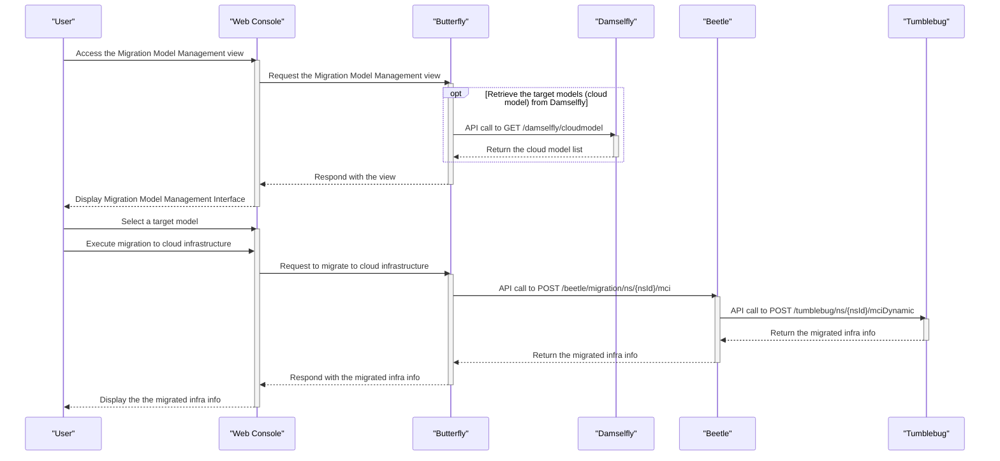

## Load computing infra migration workflow template and make/create a workflow 

: Participants: Butterfly, Damselfly, Cicada, Beetle

> [!IMPORTANT] 
> Question) 사용자가 지정한 Workflow에 연관되는 task_component를 어떻게 구분할 수 있을까요?

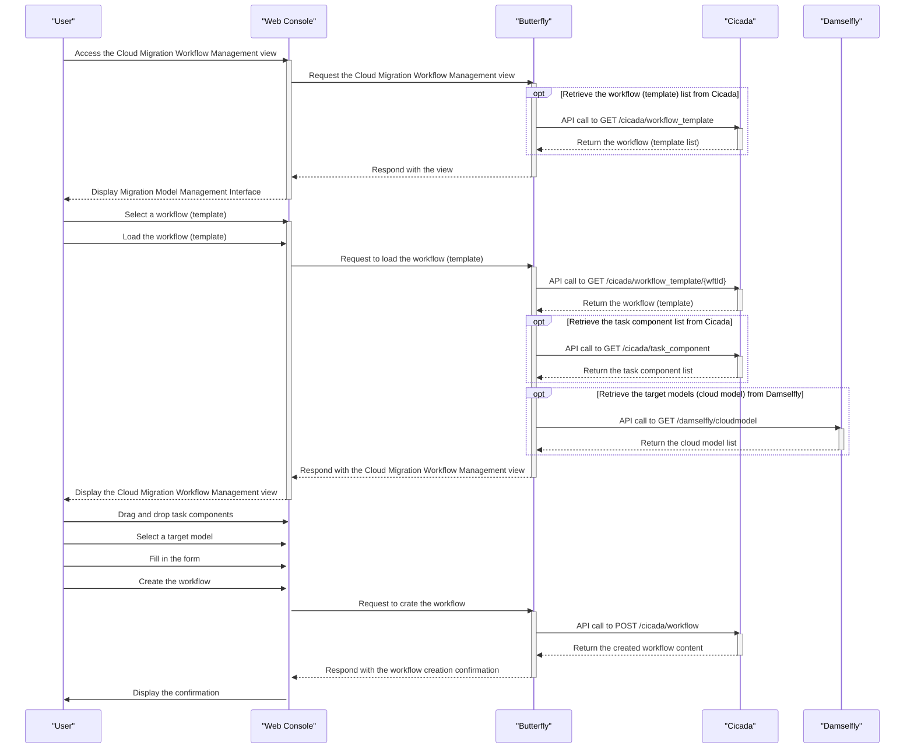

## Run a workflow 

: Participants: Butterfly, Cicada, Damselfly

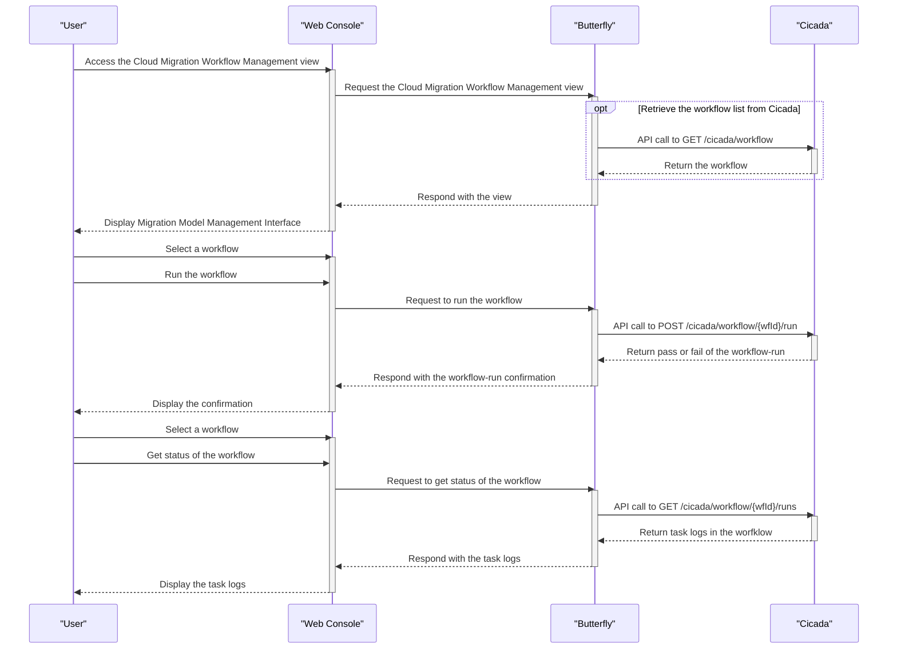

## Estimate price for the migrated cloud infrastructure

: Participants: Butterfly, Ant, Beetle, 

> [!IMPORTANT] 
> Question) Price 정보는 사전에 Spider에서 조회 후 관리하는 것으로 이해하고 있어 아래 다이어그램에 반영하지 않았습니다. 가격 추청에 대한 API가 맞는지 확인 바랍니다.

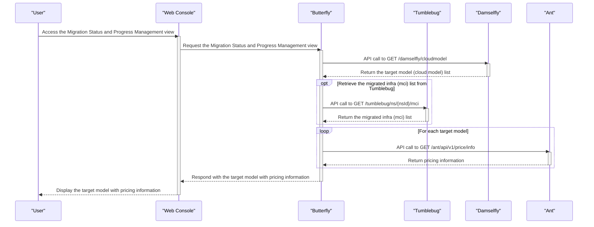

# Software infra migration (TBD)

