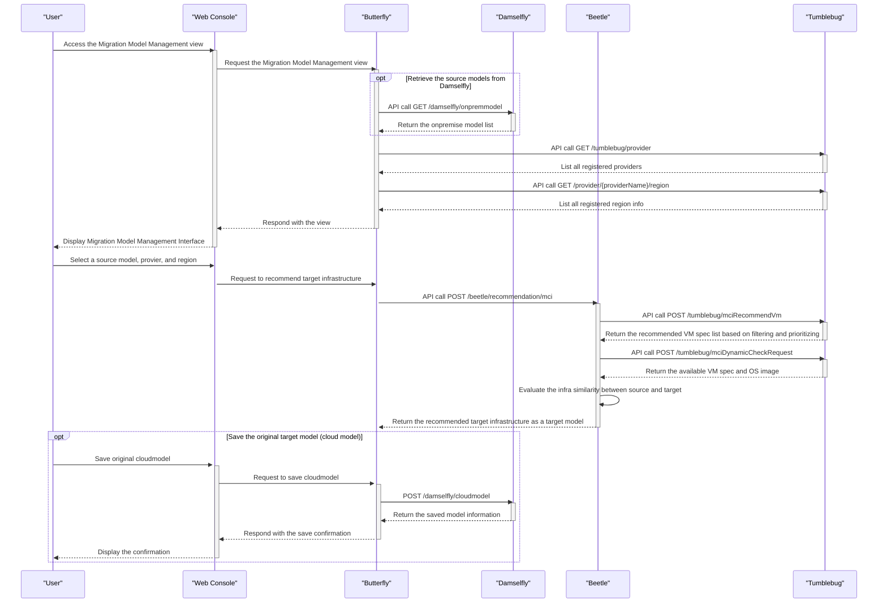
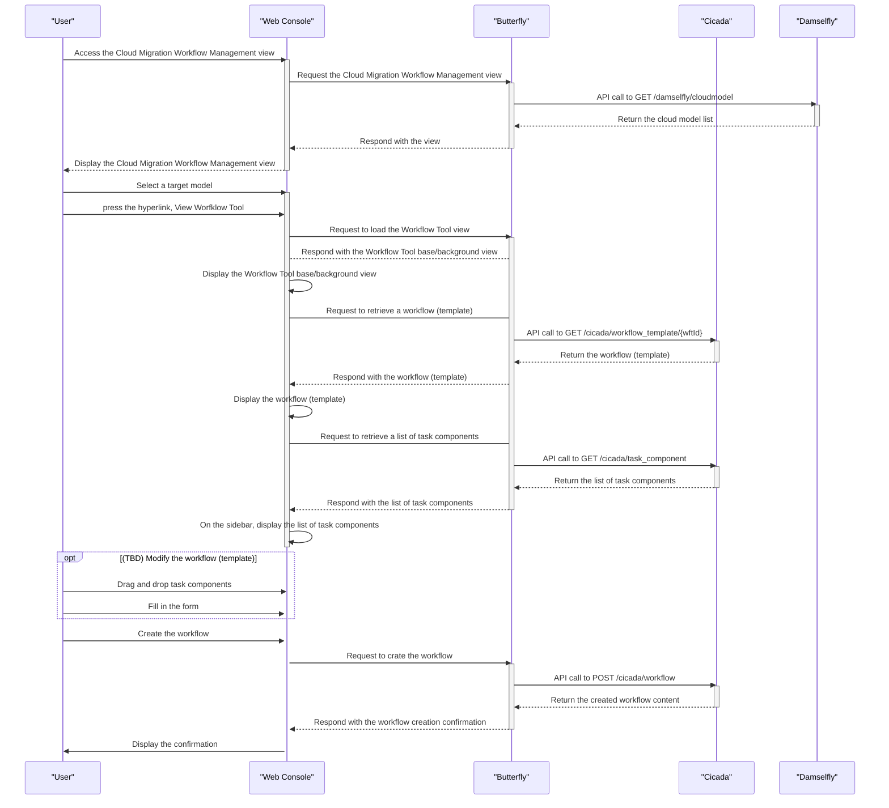
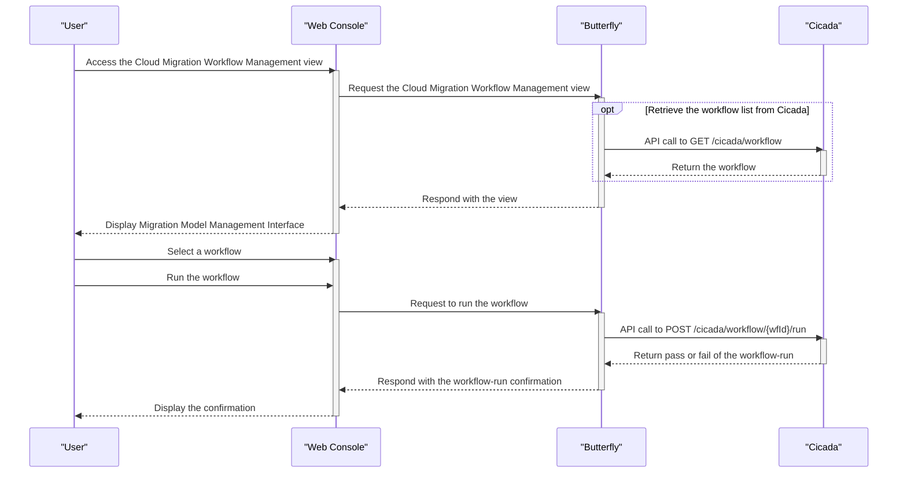
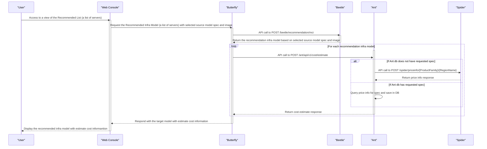

# Computing infra migration scenarios

The sequence diagrams represent user scenarios for computing infra migration.

> [!NOTE]
> 원활한 Cloud-Migrator v0.3.0 통합 및 릴리스를 위해 Sequence Diagram을 작성하였습니다.
> 그 동안 협의된 사항과 사용자 시나리오를 바탕으로 작성되었습니다.

> [!TIP]
> 수정, 보완이 필요한 사항들에 대해 많은 의견을 부탁드립니다.
> 제안) 수정/보완 사항을 PR로 오픈하고 논의하면 좋을 것 같습니다. 🙌

## Login

: Participants: Butterfly

## Register the source computing environment 

: Participants: Butterfly, Honeybee, Source computing environment

: Computing environment includes computing infrastructure, software, data
: Currently, we're concentrating on the compuing infrasturcture.

> [!IMPORTANT] 
> Question) Honeybee README에서 한번에 하나의 서버에 대한 Connection Info를 등록하는 예시를 확인할 수 있습니다. 한번에 여러 서버들의 Connection Info를 등록할 수 있는 방법이 있는지요?

## Extract information from the source computing environment

: Participants: Butterfly, Honeybee, Source computing environment

> [!IMPORTANT] 
> Question) `GET /honeybee/source_group/{sgID}/import/infra`에서 import 용어 변경/개선이 필요해 보여 의견을 남겨놓습니다. 

## Retrieve the information of source computing environment (raw data, shape information)

: Participants: Butterfly, Honeybee

## Retrieve the information of source computing environment (refined data, onpremise model)

: Participants: Butterfly, Honeybee, Damselfly

## Register or modify user's source model

: Participants: Butterfly, Damselfly, Honeybee

> [!IMPORTANT]
> Opinion) 모델 관련 UI 구성과 이를 위해 필요한 API 목록, 호출 순서, 호출 시점 등에 대해 논의/정리가 필요해 보입니다.

## Recommend the target computing infrastructure

: Participants: Butterfly, Damselfly, Beetle, Tumblebug

## Register or modify user's target model

: Participants: Butterfly, Damselfly

## Migrate to cloud infrastructure

: Participants: Butterfly, Damselfly, Beetle, Tumblebug

## Load computing infra migration workflow template and make/create a workflow 

: Participants: Butterfly, Damselfly, Cicada

> [!NOTE] 
> * 다음은 몇 차례 논의 과정을 거치면서 점차 상세한 부분들이 표현된 시퀀스 다이어그램입니다.
> * 상세함의 정도는 논의 내용에 따라 적절히 반영해주시기 바랍니다. 
>   - 참고 - 지나치게 상세하게 작성하는 것은 지양하고자 합니다 ^^;;

> [!NOTE] 
> (참고) 다음은 Butterfly의 Frontend와 Backend 간에 세부 호출 관계를 나타내고 있습니다.
> (참고) 이는 다음과 같이 포괄적으로 나타낼 수 있습니다.
> --> Web Console에서 Butterfly에 Workflow Tool view 요청
> --> Butterfly에서 Cicada의 Workflow template 조회 API 호출
> --> Butterfly에서 Cicada의 Task components API 호출
> --> Butterfly에서 Web Console로 Workflow Tool view 응답

## Run a workflow 

: Participants: Butterfly, Cicada

## Estimate cost for the recommend infra based on selected source model

: Participants: Butterfly, Beetle, Ant, Spider

# Software infra migration (TBD)

