# Computing infra migration scenarios

The sequence diagrams represent user scenarios for computing infrastructure migration.

> [!IMPORTANT]
> 원활한 Cloud-Migrator v0.4.0 통합 및 릴리스를 위한 Sequence Diagram 입니다.
> 이번 통합 테스트 및 릴리스를 위하여 사용자 시나리오 개선이 필요합니다. 🙏

> [!TIP]
> 수정/보완 사항들은 PR로 오픈하여 논의/협의를 진행해 주시기 바랍니다. 🙌

## Login

- Participants: Butterfly

> [!NOTE]
>
> - 사용자가 Cloud-Migrator 웹 콘솔에 로그인하는 과정을 나타냅니다.
> - 주요 흐름:
>   - --> 사용자가 웹 콘솔 접근
>   - --> 로그인 페이지 표시
>   - --> 로그인 자격 증명 입력 및 검증
>   - --> 대시보드 페이지로 이동

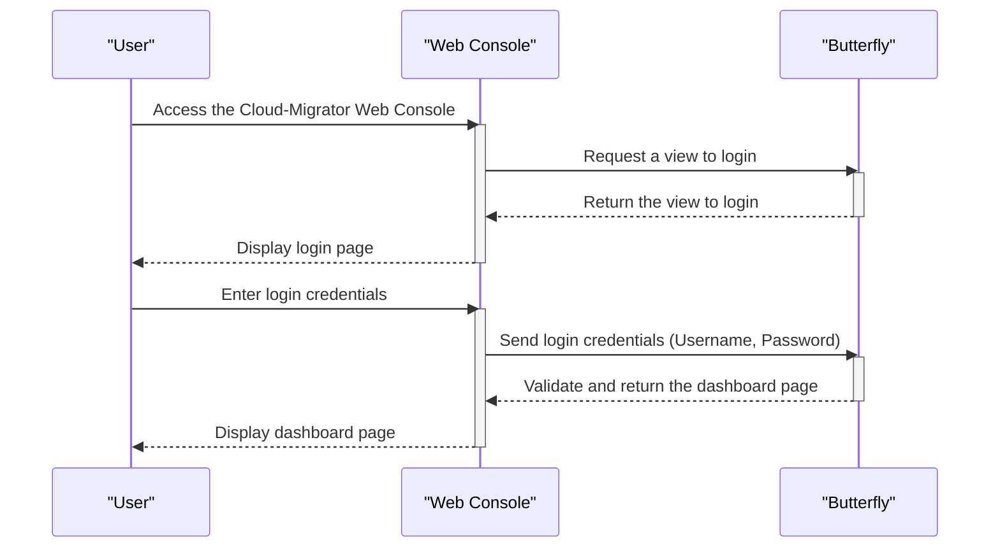

## Register the source computing environment

- Note - Computing environment includes computing infrastructure, software, and data
- Participants: Butterfly, Honeybee, Source computing environment

> [!NOTE]
>
> - 소스 컴퓨팅 환경을 등록하는 과정을 나타냅니다.
> - 주요 흐름:
>   - --> 소스 그룹 등록 및 ID 생성
>   - --> 연결 정보 등록 및 에이전트 설치
>   - --> 소스 환경과의 연결 상태 확인

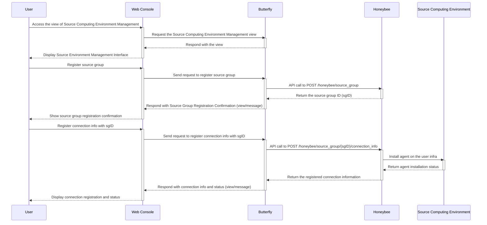

## Discover and then extract the source computing environment

- Participants: Butterfly, Honeybee, Source computing environment

> [!NOTE]
>
> - 등록된 소스 컴퓨팅 환경을 검색하고 정보를 추출하는 과정을 나타냅니다.
> - 주요 흐름:
>   - --> 연결 상태 직접 갱신
>   - --> 소스 환경의 인프라 정보 추출
>   - --> 추출된 정보 저장 및 확인

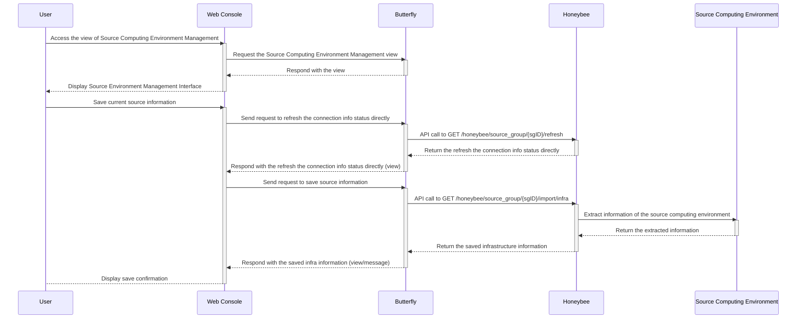

## Retrieve the raw data of the source computing environment

- Note - This refers to the raw, unprocessed data that was discovered and extracted from the source computing environment.
- Participants: Butterfly, Honeybee

> [!NOTE]
>
> - 소스 컴퓨팅 환경에서 추출된 원시 데이터를 조회하는 과정을 나타냅니다.
> - 주요 흐름:
>   - --> 저장된 소스 정보 조회 요청
>   - --> 원시 인프라 데이터 반환
>   - --> JSON 에디터를 통한 데이터 표시

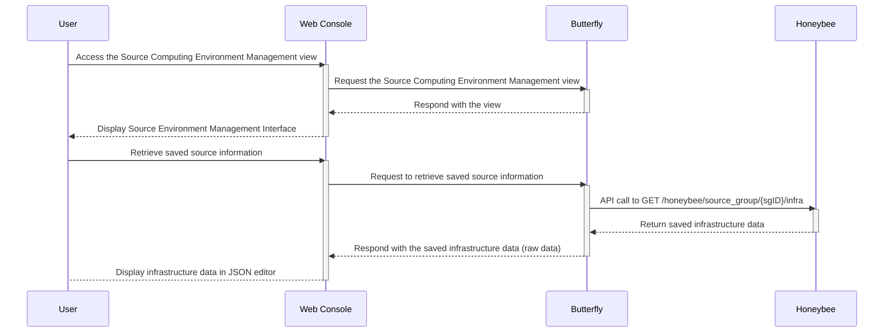

## Retrieve the refined data (source model) of the source computing environment

- Note - This refers to the processed and structured metadata, or 'source model,' that is essential for migration planning.
- Note - The source model for computing infrastructure migration includes 'the on-premise infra model'.
- Participants: Butterfly, Honeybee, Damselfly

> [!NOTE]
>
> - 소스 컴퓨팅 환경의 정제된 데이터(소스 모델)를 조회하는 과정을 나타냅니다.
> - 주요 흐름:
>   - --> 정제된 인프라 데이터 조회
>   - --> 온프레미스 모델로 저장 (선택적)
>   - --> 마이그레이션 계획에 필요한 구조화된 메타데이터 제공

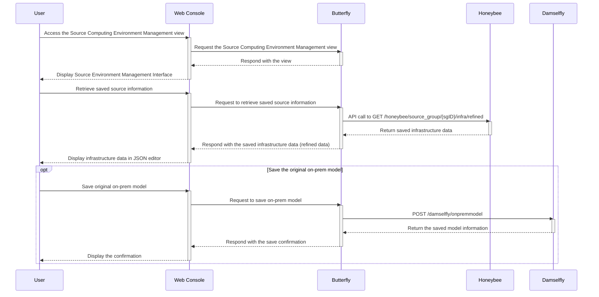

## Register or modify user's source model

: Note - In here, source model includes 'on-premise infra model'.
: Participants: Butterfly, Damselfly, Honeybee

> [!NOTE]
>
> - 사용자의 소스 모델(온프레미스 인프라 모델)을 등록하거나 수정하는 과정을 나타냅니다.
> - 주요 흐름:
>   - --> 마이그레이션 모델 관리 뷰 로드
>   - --> 온프레미스 모델 저장
>   - --> JSON 에디터를 통한 모델 수정 및 버전 관리

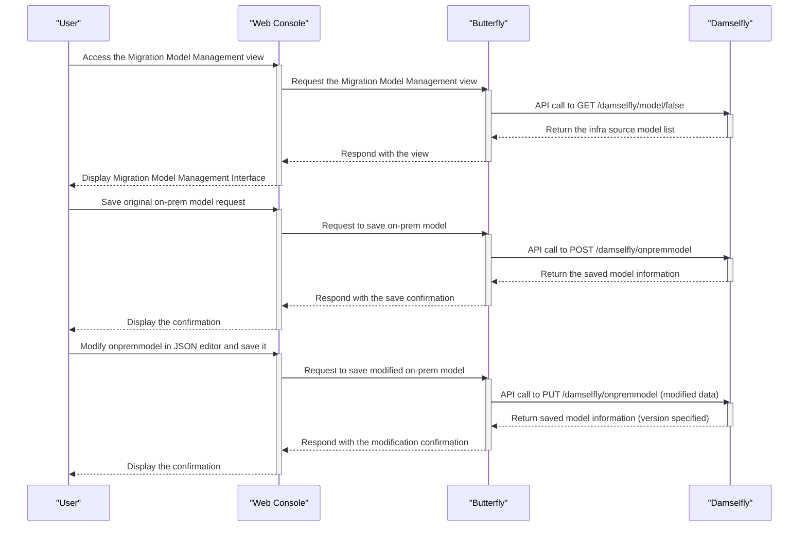

## Recommend the target computing infrastructure

: Note - In here, the recommended target computing infrastructure source model refers to 'target model' or 'cloud infra model'.
: Participants: Butterfly, Damselfly, Beetle, Tumblebug

> [!NOTE]
>
> - 소스 모델을 기반으로 타겟 클라우드 인프라를 추천하는 과정을 나타냅니다.
> - 주요 흐름:
>   - --> 프로바이더 및 리전 정보 조회
>   - --> Beetle을 통한 다양한 리소스 추천 (vNet, VM 스펙, OS 이미지, 보안 그룹 등)
>   - --> 소스와 타겟 간 인프라 유사성 평가
>   - --> 추천된 타겟 인프라를 클라우드 모델로 저장 (선택적)

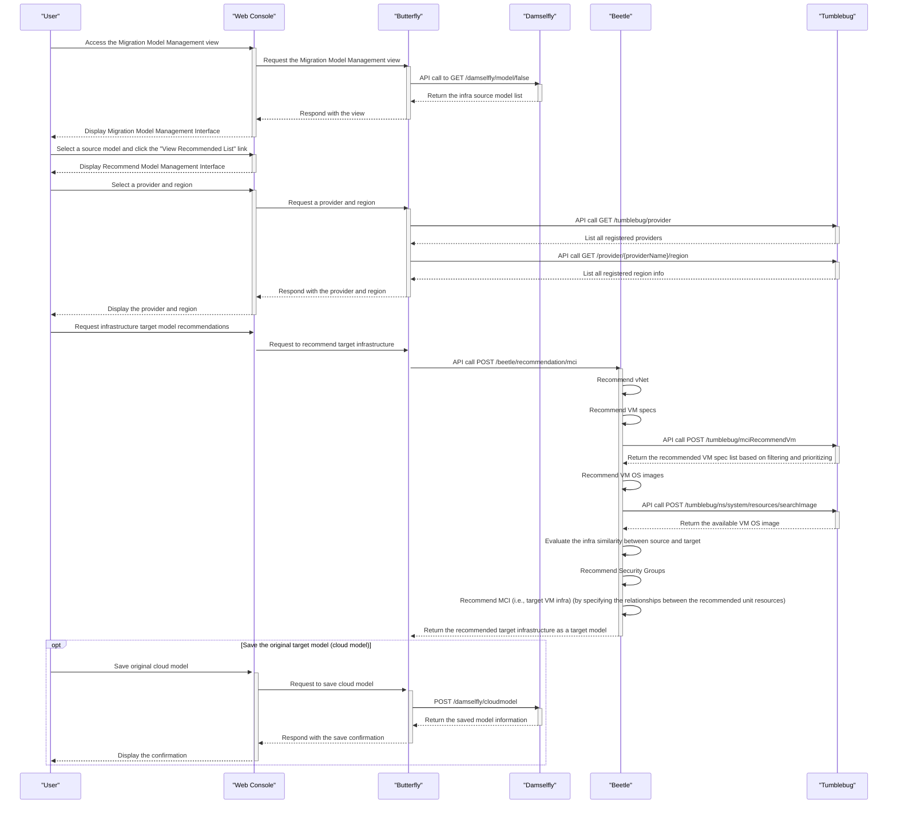

## Register or modify user's target model

: Note - In here, target model is also known as 'cloud infra model'.
: Participants: Butterfly, Damselfly

> [!NOTE]
>
> - 사용자의 타겟 모델(클라우드 인프라 모델)을 등록하거나 수정하는 과정을 나타냅니다.
> - 주요 흐름:
>   - --> 온프레미스 모델 및 클라우드 모델 목록 조회
>   - --> 클라우드 모델 저장
>   - --> JSON 에디터를 통한 클라우드 모델 수정 및 버전 관리

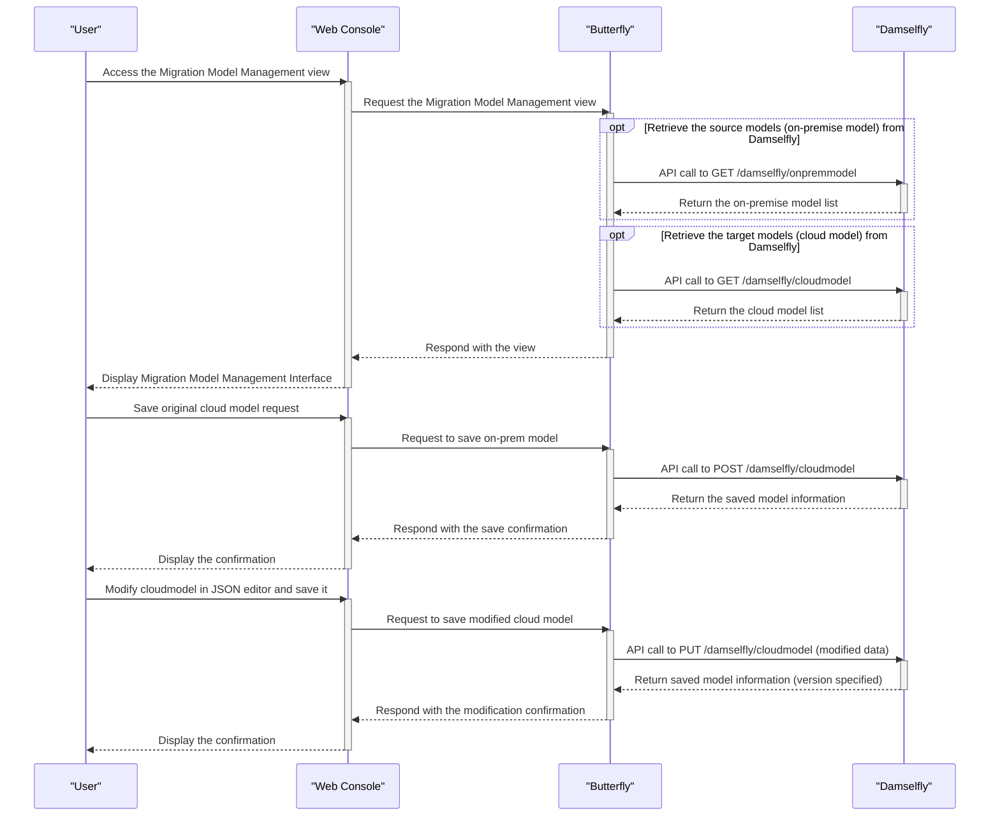

## Migrate to cloud infrastructure

: Participants: Butterfly, Damselfly, Beetle, Tumblebug

> [!NOTE]
>
> - 타겟 모델을 기반으로 실제 클라우드 인프라로 마이그레이션을 수행하는 과정을 나타냅니다.
> - 주요 흐름:
>   - --> 타겟 모델 선택
>   - --> Beetle을 통한 마이그레이션 실행
>   - --> Tumblebug을 통한 클라우드 리소스 생성 (네임스페이스, vNet, SSH 키, 보안 그룹, MCI)
>   - --> 마이그레이션 완료 및 결과 표시

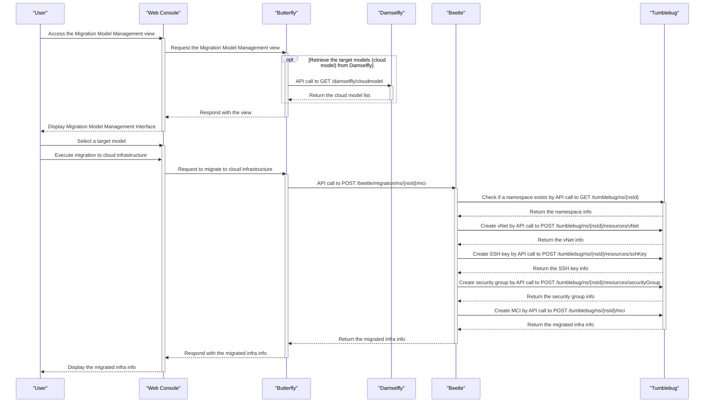

## Load computing infra migration workflow template and make/create a workflow

: Participants: Butterfly, Damselfly, Cicada

> [!NOTE]
>
> - 클라우드 마이그레이션 워크플로우 템플릿을 로드하고 새로운 워크플로우를 생성하는 과정을 나타냅니다.
> - 주요 흐름:
>   - --> 클라우드 모델 목록 조회 및 워크플로우 관리 뷰 로드
>   - --> 워크플로우 툴 뷰 요청 및 템플릿 조회
>   - --> 태스크 컴포넌트 목록 조회 및 표시
>   - --> 드래그 앤 드롭을 통한 워크플로우 수정 및 생성
> - (참고) 다음은 Butterfly의 Frontend와 Backend 간에 세부 호출 관계를 나타내고 있습니다.

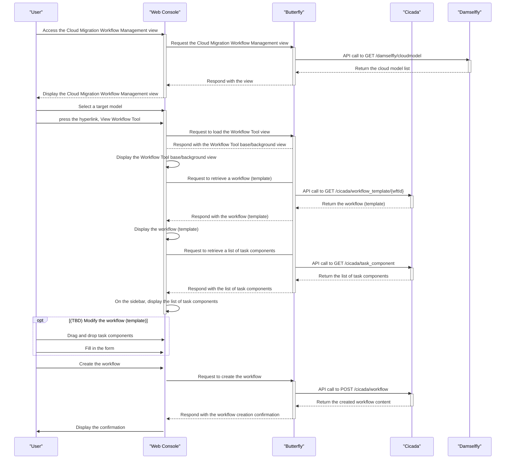

## Run a workflow

: Participants: Butterfly, Cicada

> [!NOTE]
>
> - 생성된 워크플로우를 실행하는 과정을 나타냅니다.
> - 주요 흐름:
>   - --> 워크플로우 목록 조회
>   - --> 워크플로우 선택 및 실행
>   - --> 실행 결과 확인 (성공/실패)

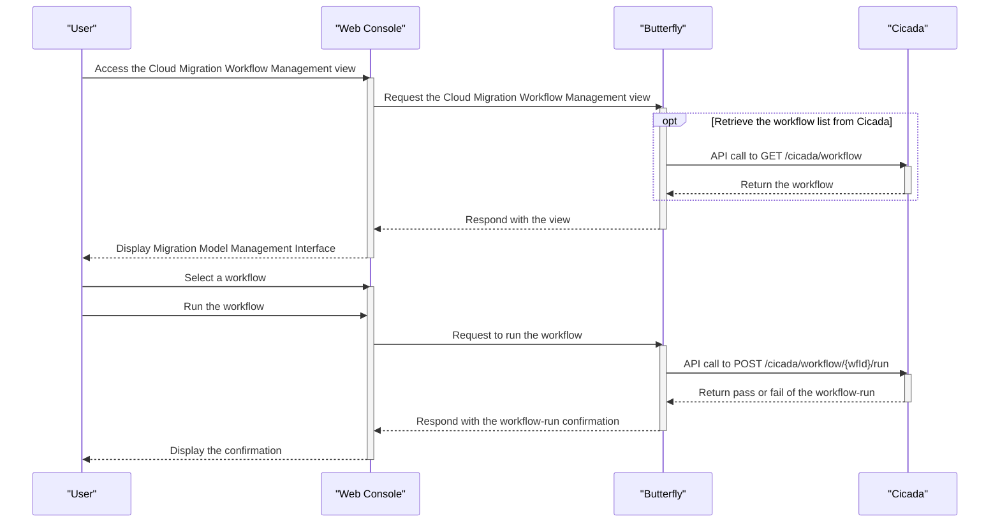

## Estimate cost for the recommended infrastructure based on the selected source model

: Participants: Butterfly, Beetle, Ant, Spider

> [!NOTE]
>
> - 선택된 소스 모델을 기반으로 추천된 인프라의 비용을 추정하는 과정을 나타냅니다.
> - 주요 흐름:
>   - --> 추천 인프라 모델 조회 (Beetle)
>   - --> 각 모델에 대한 비용 추정 (Ant)
>   - --> 필요시 Spider를 통한 가격 정보 조회
>   - --> 비용 정보가 포함된 추천 인프라 모델 표시

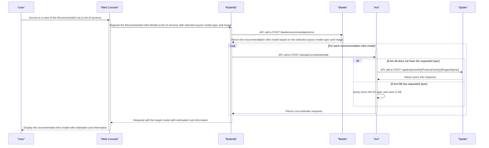
