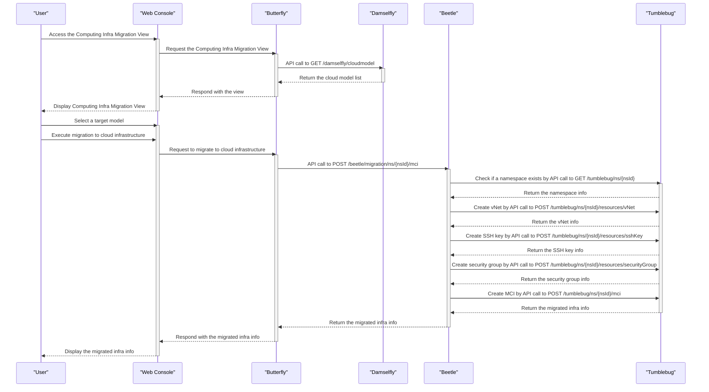
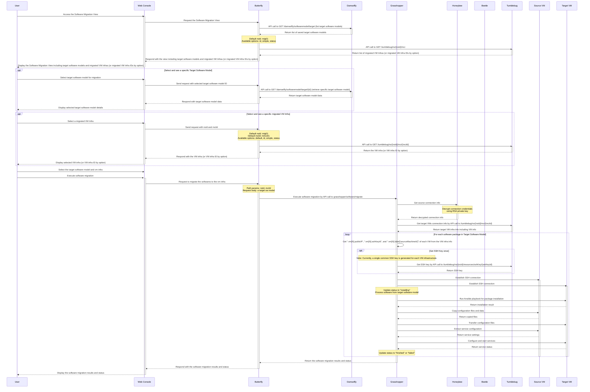

# Integrated migration scenarios (Computing Infrastructure + Software)

The sequence diagrams represent user scenarios for integrated cloud migration, progressing from computing infrastructure migration to software migration. (ref: https://github.com/cloud-barista/cloud-migrator/discussions/25)

- **Precondition**: User has access to Cloud-Migrator web console and has both source infrastructure and software environments to migrate.
- **Postcondition**: Complete cloud migration with both infrastructure and software successfully migrated and operational on the target cloud environment.

> [!IMPORTANT]
> 원활한 Cloud-Migrator v0.4.0 통합 및 릴리스를 위한 Sequence Diagram 입니다.
> 이번 통합 테스트 및 릴리스를 위하여 사용자 시나리오 개선이 필요합니다. 🙏

> [!TIP]
> 수정/보완 사항들은 PR로 오픈하여 논의/협의를 진행해 주시기 바랍니다. 🙌

## Computing Infrastructure Migration Scenario

- Precondition: The user gets a recommended target infrastructure (i.e., target infra model) via Beetle.
- Postcondition: After migration, the user manages the migrated infrastructure via Tumblebug.
- Participants: User, Butterfly, Damselfly, Beetle, Tumblebug

> [!NOTE]
>
> - 컴퓨팅 인프라 마이그레이션의 전체 과정을 나타냅니다.
> - 주요 흐름:
>   - --> 소스 인프라 등록 및 정보 수집
>   - --> 타겟 인프라 모델 추천 및 생성
>   - --> 컴퓨팅 인프라 마이그레이션 실행
>   - --> Tumblebug을 통한 마이그레이션된 인프라 관리
> - 이 과정을 통해 생성된 MCI는 후속 소프트웨어 마이그레이션의 타겟 환경으로 사용됩니다.

## Software Migration Scenario

- **Precondition**: The user gets a confirmed target software list (i.e., target sw model) via Grasshopper.
- **Postcondition**: 필요시 추가 바랍니다.

- Participants: Butterfly, Damselfly, Grasshopper, Honeybee, Tumblebug

