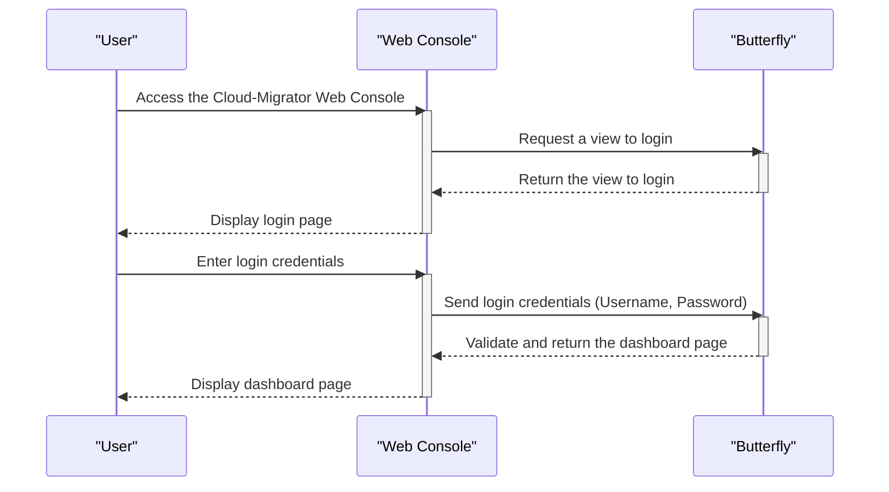
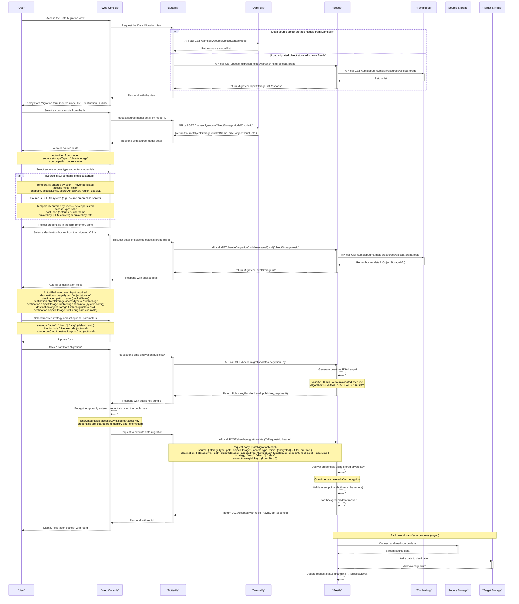
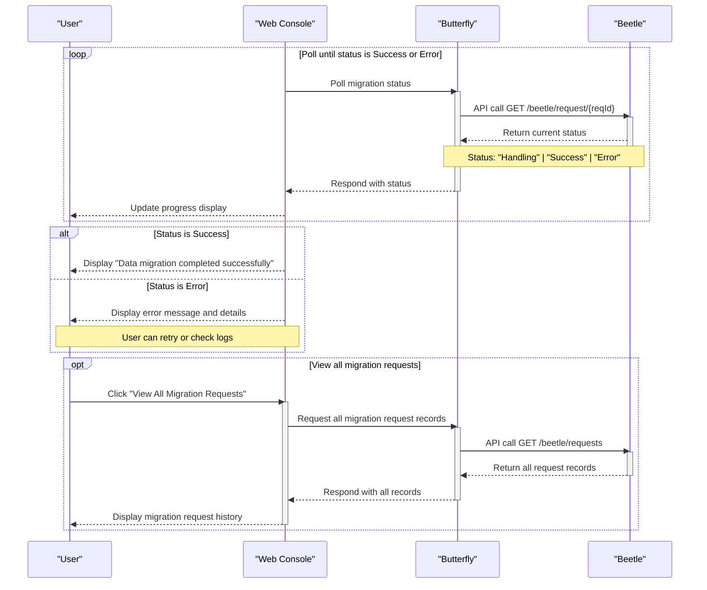
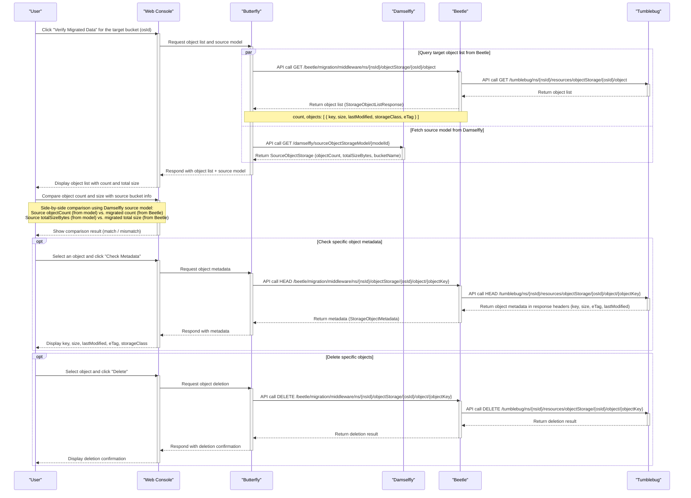

# Data migration scenarios

> [!IMPORTANT]
> This document describes the **portal/upper-subsystem perspective** of data migration scenarios.
> The scenarios represent the interaction between the user, the web console (Butterfly), and backend subsystems (Beetle) during the full data migration workflow.

> [!NOTE]
> Data migration transfers actual data (files or objects) between a source endpoint and a target endpoint.
> Both source and destination must be **remote** endpoints (SSH filesystem or object storage).
> Local filesystem access is not permitted for security reasons.
>
> This scenario assumes the target object storage buckets are already created via the object storage migration workflow.
> Refer to [v0.6.0-user-scenario-for-object-storage-migration.md](./v0.6.0-user-scenario-for-object-storage-migration.md) for the object storage migration scenario.

> [!NOTE]
> **Namespace (nsId):** All migration APIs require a namespace ID (`nsId`). Use the same namespace selected during the object storage migration workflow. The migrated object storage list is scoped to this `nsId`.

---

## Login

- Participants: Butterfly

> [!NOTE]
>
> - The user logs in to the Cloud-Migrator web console.
> - Key flow:
>   - --> User accesses the web console
>   - --> Login page is displayed
>   - --> User enters credentials and they are validated
>   - --> User is redirected to the dashboard

---

## Execute data migration

- Participants: Butterfly, Damselfly, Beetle, Tumblebug, Source Storage, Target Storage

> [!NOTE]
>
> - The data migration view loads source models (Damselfly) and migrated object storages (Beetle) simultaneously when the page opens.
> - Source `path` is auto-filled from the registered model; access credentials are **entered temporarily by the user at migration time and are never persisted**.
> - Destination is **fully auto-filled** from the migrated object storage info (tumblebug accessType).
> - The portal automatically obtains a one-time encryption key, encrypts the temporarily entered credentials client-side, and sends the encrypted request to Beetle.
> - This is an **asynchronous** operation — Beetle returns `reqId` immediately and runs the transfer in the background.
> - Key flow:
>   - --> Page loads source model list (Damselfly) and migrated OS list (Beetle) in parallel
>   - --> User selects source model → `bucketName` auto-fills as `source.path`
>   - --> User temporarily enters source access credentials (not stored anywhere)
>   - --> User selects destination OS → all destination fields auto-filled (tumblebug)
>   - --> User selects transfer strategy and optionally sets filter / pre/post commands
>   - --> Portal gets one-time encryption key from Beetle → encrypts credentials client-side
>   - --> Portal assembles `DataMigrationModel` and calls `POST /migration/data`
>   - --> Beetle returns `202 Accepted` with `reqId`

> [!TIP]
>
> **API request/response examples and test results**
> The following test result files contain real API request bodies, response bodies, and migration results for each source-to-destination cloud pair.
> Refer to these to understand the expected input/output of the data migration API.
>
> - [`cmd/test-cli/data/testresult/`](https://github.com/cloud-barista/cm-beetle/tree/main/cmd/test-cli/data/testresult)
>   - [AWS → AWS](https://github.com/cloud-barista/cm-beetle/blob/main/cmd/test-cli/data/testresult/data-test-results-aws-to-aws.md)
>   - [AWS → Azure](https://github.com/cloud-barista/cm-beetle/blob/main/cmd/test-cli/data/testresult/data-test-results-aws-to-azure.md)
>   - [AWS → GCP](https://github.com/cloud-barista/cm-beetle/blob/main/cmd/test-cli/data/testresult/data-test-results-aws-to-gcp.md)
>   - [AWS → NCP](https://github.com/cloud-barista/cm-beetle/blob/main/cmd/test-cli/data/testresult/data-test-results-aws-to-ncp.md)
>   - [AWS → Alibaba](https://github.com/cloud-barista/cm-beetle/blob/main/cmd/test-cli/data/testresult/data-test-results-aws-to-alibaba.md)
>   - [AWS → IBM](https://github.com/cloud-barista/cm-beetle/blob/main/cmd/test-cli/data/testresult/data-test-results-aws-to-ibm.md)
>   - [AWS → NHN](https://github.com/cloud-barista/cm-beetle/blob/main/cmd/test-cli/data/testresult/data-test-results-aws-to-nhn.md)
>   - [AWS → KT](https://github.com/cloud-barista/cm-beetle/blob/main/cmd/test-cli/data/testresult/data-test-results-aws-to-kt.md)
>   - [AWS → Tencent](https://github.com/cloud-barista/cm-beetle/blob/main/cmd/test-cli/data/testresult/data-test-results-aws-to-tencent.md)
>   - [AWS → OpenStack](https://github.com/cloud-barista/cm-beetle/blob/main/cmd/test-cli/data/testresult/data-test-results-aws-to-openstack.md)

---

## Check migration status

- Participants: Butterfly, Beetle

> [!NOTE]
>
> - After submitting the migration request, the portal periodically checks the status using the reqId.
> - Key flow:
>   - --> Portal periodically calls the status endpoint with the reqId
>   - --> Status transitions from "Handling" to "Success" or "Error"
>   - --> Portal displays progress and final result to the user

---

## Verify migrated data (optional)

- Participants: Butterfly, Damselfly, Beetle, Tumblebug

> [!NOTE]
>
> - This step is **optional but recommended**. The migration itself is complete once the async transfer status reaches "Success".
> - The user can verify that data was transferred correctly to the target object storage at any time after migration completes.
> - The source metrics (objectCount, totalSizeBytes) for comparison are fetched from the Damselfly source model.
> - Key flow:
>   - --> Query object list in the target bucket
>   - --> Fetch source model from Damselfly to obtain baseline objectCount and totalSizeBytes
>   - --> Display side-by-side comparison of source vs. migrated counts and sizes
>   - --> Optionally check individual object metadata
>   - --> Optionally clean up unwanted objects

