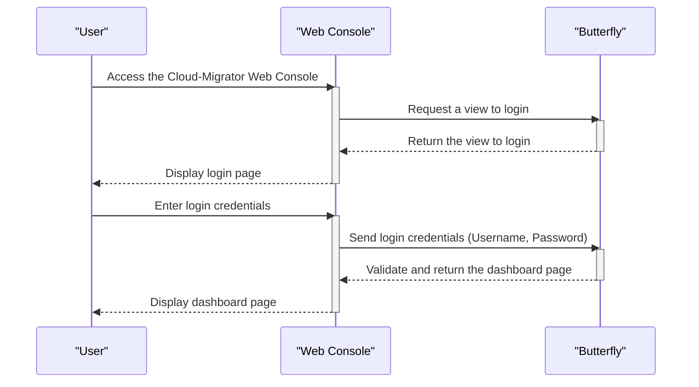
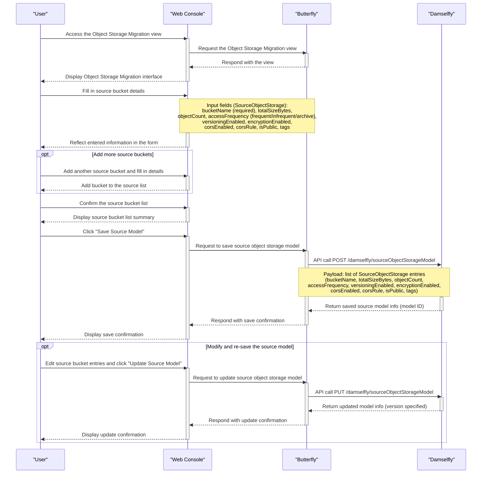
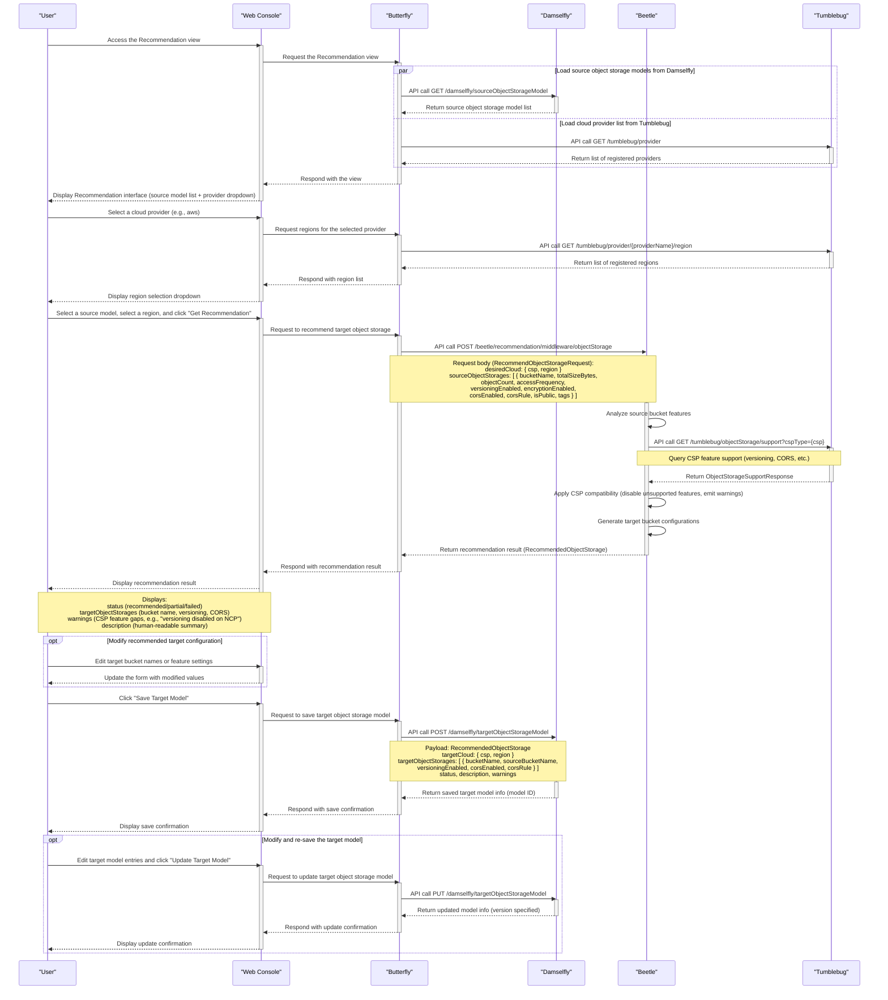
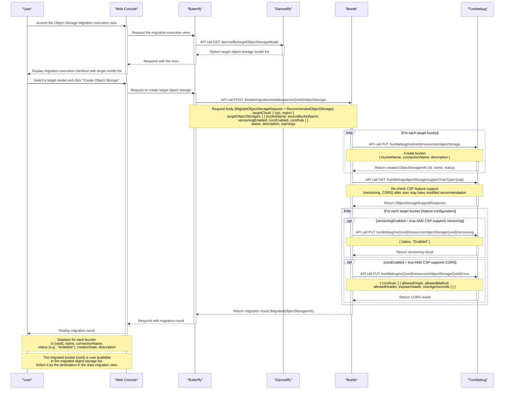
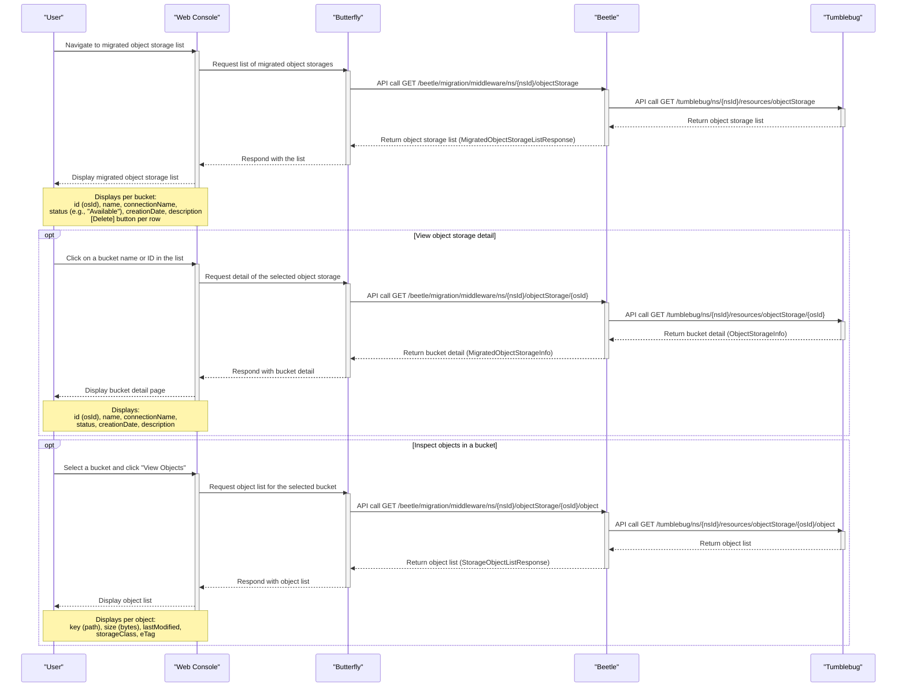
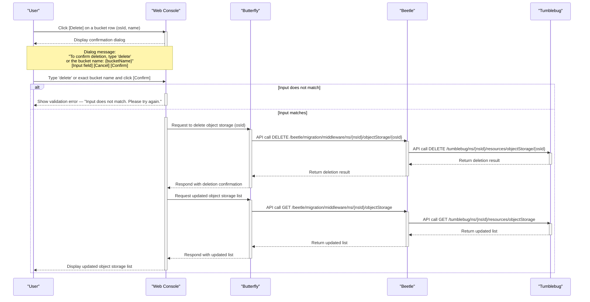

# Object Storage migration scenarios

> [!IMPORTANT]
> This document describes the **portal/upper-subsystem perspective** of object storage migration scenarios.
> The scenarios represent the interaction between the user, the web console (Butterfly), and backend subsystems (Beetle, Tumblebug) during the full object storage migration workflow.

> [!NOTE]
> Unlike computing infrastructure migration, object storage migration does **not** use an agent for source discovery.
> The user manually registers the source object storage information through the portal UI.

> [!NOTE]
> **Namespace (nsId):** All migration APIs require a namespace ID (`nsId`). The namespace is selected or created at the start of the workflow (typically shared with the computing infrastructure migration). All object storage resources created in this workflow are scoped to the selected `nsId`.

---

## Login

- Participants: Butterfly

> [!NOTE]
>
> - The user logs in to the Cloud-Migrator web console.
> - Key flow:
>   - --> User accesses the web console
>   - --> Login page is displayed
>   - --> User enters credentials and they are validated
>   - --> User is redirected to the dashboard

---

## Register source object storage information

- Participants: Butterfly, Damselfly

> [!NOTE]
>
> - The user manually registers information about the source object storage buckets.
> - No agent installation is required — the user directly inputs all bucket metadata through the portal UI.
> - The registered source bucket list is saved to Damselfly as a **source object storage model** for use in the recommendation step.
> - Key flow:
>   - --> User navigates to the Object Storage Migration view
>   - --> User fills in source bucket details (name, size, object count, access frequency, feature flags, tags, etc.)
>   - --> User adds multiple buckets to the source list if needed
>   - --> User saves the source bucket list to Damselfly as a source object storage model

> [!TIP]
>
> **Model specification (storage-model)**
> All input fields on the registration form are defined in the following model file.
> Refer to this before designing or implementing the registration UI.
>
> - [`imdl/storage-model/model.go`](https://github.com/cloud-barista/cm-beetle/blob/main/imdl/storage-model/model.go)
>   - `SourceObjectStorage`: source bucket fields (bucketName, totalSizeBytes, objectCount, accessFrequency, versioningEnabled, encryptionEnabled, corsEnabled, corsRule, isPublic, tags)
>   - `TargetObjectStorage`: target bucket fields (bucketName, sourceBucketName, versioningEnabled, corsEnabled, corsRule)
>   - `RecommendedObjectStorage`: recommendation result and direct input to the migration API (status, description, warnings, targetCloud, targetObjectStorages)
>   - `CloudProperty`: cloud provider and region pair (csp, region)

---

## Recommend target object storage

- Participants: Butterfly, Damselfly, Beetle, Tumblebug

> [!NOTE]
>
> - The view loads the saved source object storage models from Damselfly for selection.
> - The user selects the target CSP and region on the same view (provider/region lists are loaded from Tumblebug when the page opens).
> - Based on the selected source model and target cloud, Beetle recommends the target object storage configuration.
> - The recommendation result is saved to Damselfly as a **target object storage model**.
> - Key flow:
>   - --> Load source object storage model list from Damselfly in parallel with provider list from Tumblebug
>   - --> User selects a source model and a target CSP/region on the same form
>   - --> User clicks "Get Recommendation" → Beetle analyzes and returns target configuration
>   - --> Beetle performs feature-compatibility analysis and generates target bucket configurations
>   - --> Display recommendation result including target bucket names, feature settings, and warnings
>   - --> User reviews and optionally modifies the recommendation
>   - --> Save the recommendation result to Damselfly as a target object storage model

> [!TIP]
>
> **API request/response examples and test results**
> The following test result files contain real API request bodies, response bodies, and migration results for each cloud provider.
> Refer to these to understand the expected input/output of the recommendation and migration APIs.
>
> - [`cmd/test-cli/object-storage/testresult/`](https://github.com/cloud-barista/cm-beetle/tree/main/cmd/test-cli/object-storage/testresult)
>   - [AWS](https://github.com/cloud-barista/cm-beetle/blob/main/cmd/test-cli/object-storage/testresult/os-test-results-aws.md)
>   - [Azure](https://github.com/cloud-barista/cm-beetle/blob/main/cmd/test-cli/object-storage/testresult/os-test-results-azure.md)
>   - [GCP](https://github.com/cloud-barista/cm-beetle/blob/main/cmd/test-cli/object-storage/testresult/os-test-results-gcp.md)
>   - [NCP](https://github.com/cloud-barista/cm-beetle/blob/main/cmd/test-cli/object-storage/testresult/os-test-results-ncp.md)
>   - [Alibaba](https://github.com/cloud-barista/cm-beetle/blob/main/cmd/test-cli/object-storage/testresult/os-test-results-alibaba.md)
>   - [IBM](https://github.com/cloud-barista/cm-beetle/blob/main/cmd/test-cli/object-storage/testresult/os-test-results-ibm.md)
>   - [NHN](https://github.com/cloud-barista/cm-beetle/blob/main/cmd/test-cli/object-storage/testresult/os-test-results-nhn.md)
>   - [KT](https://github.com/cloud-barista/cm-beetle/blob/main/cmd/test-cli/object-storage/testresult/os-test-results-kt.md)
>   - [Tencent](https://github.com/cloud-barista/cm-beetle/blob/main/cmd/test-cli/object-storage/testresult/os-test-results-tencent.md)
>   - [OpenStack](https://github.com/cloud-barista/cm-beetle/blob/main/cmd/test-cli/object-storage/testresult/os-test-results-openstack.md)

---

## Create (migrate) target object storage buckets

- Participants: Butterfly, Damselfly, Beetle, Tumblebug

> [!NOTE]
>
> - The view loads the saved target object storage models from Damselfly for selection.
> - The user proceeds with the selected (or modified) target model to create object storage buckets in the target cloud.
> - Beetle calls Tumblebug to create the actual cloud resources.
> - Key flow:
>   - --> Load target object storage model list from Damselfly
>   - --> User selects a target model and clicks "Create Object Storage"
>   - --> Beetle calls Tumblebug to create each bucket
>   - --> Migration result including bucket ID (osId) and status is returned
>   - --> The osId is retained for use in the data migration step

---

## List migrated object storages

- Participants: Butterfly, Beetle, Tumblebug

> [!NOTE]
>
> - The user navigates to the migrated object storage list page to review all buckets created in the target cloud.
> - From this page, the user can inspect objects inside each bucket and initiate deletion.
> - Key flow:
>   - --> Query all migrated object storages in the namespace
>   - --> Display the list with bucket ID, name, connection, status, and creation date
>   - --> User selects a bucket to inspect its objects

---

## Delete migrated object storage

- Participants: Butterfly, Beetle, Tumblebug

> [!NOTE]
>
> - The user initiates deletion from the migrated object storage list page.
> - To prevent accidental deletion, the portal requires the user to confirm by typing either `delete` or the exact bucket name before the delete request is sent.
> - Key flow:
>   - --> User clicks the [Delete] button for a bucket in the list
>   - --> Portal displays a confirmation dialog
>   - --> User types `delete` or the exact bucket name to confirm
>   - --> Portal validates the input and sends the delete request to Beetle
>   - --> Beetle removes the bucket via Tumblebug and returns the result
>   - --> Portal refreshes the object storage list

